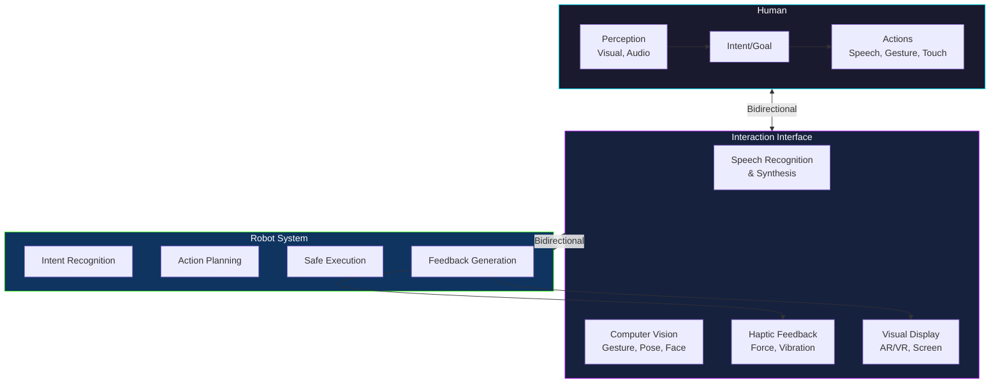
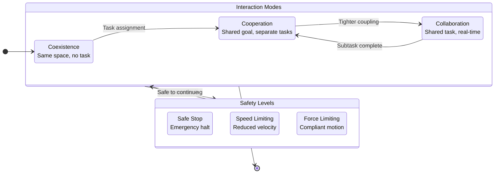

# Module 10: Robot-Human Interaction (HRI)

## 10.1 Introduction to Human-Robot Interaction

### Definition and Importance of HRI
Human-Robot Interaction (HRI) is a field of study dedicated to understanding, designing, and evaluating robotic systems for use by or with humans. It is an interdisciplinary field, drawing on aspects of robotics, artificial intelligence, cognitive psychology, human factors, ergonomics, and design. The importance of HRI stems from the increasing integration of robots into human-centric environments, moving beyond segregated industrial settings to collaborative workspaces, homes, healthcare facilities, and public spaces. Effective HRI is crucial for ensuring that robots are safe, efficient, usable, and socially acceptable.

### Historical Context and Evolution of Robotics
The journey of robotics began with industrial automation, where robots were largely confined to cages, performing repetitive tasks with precision and speed but without direct human interaction. Early robots were programmed for specific, pre-defined movements, and safety protocols primarily focused on keeping humans out of the robot's operational range. The evolution towards more sophisticated AI, advanced sensing, and improved control systems has enabled robots to operate in less structured environments and, crucially, to work alongside humans. This shift has necessitated a deeper understanding of how humans and robots can co-exist and collaborate effectively.

### Goals and Objectives of HRI Research
The primary goals of HRI research include:
*   **Enhancing Safety:** Developing robots that can operate safely in proximity to humans, anticipating and reacting to human presence and actions.
*   **Improving Efficiency and Productivity:** Designing robots that can augment human capabilities and work collaboratively to achieve tasks more effectively than either could alone.
*   **Increasing Usability and Accessibility:** Making robots intuitive and easy for diverse users to interact with, regardless of their technical expertise.
*   **Fostering Trust and Acceptance:** Creating robots that are perceived as reliable, predictable, and beneficial, thereby promoting their adoption and integration into society.
*   **Enabling Natural Interaction:** Developing interfaces and behaviors that allow humans to interact with robots using natural communication modalities like speech, gestures, and gaze.

### Key Disciplines Contributing to HRI
HRI is inherently multidisciplinary, drawing insights and methodologies from:
*   **Robotics:** The engineering and development of robots themselves, including their mechanics, control systems, and perception capabilities.
*   **Artificial Intelligence (AI):** Machine learning, computer vision, natural language processing, and planning algorithms that enable robots to understand, learn, and reason.
*   **Psychology:** Understanding human cognition, perception, social behavior, and emotional responses to robots.
*   **Ergonomics:** Designing robots and human-robot systems to optimize human well-being and overall system performance.
*   **Design (Industrial Design, Interaction Design, UX Design):** Creating robots that are aesthetically pleasing, functional, and provide a positive user experience.

### HRI System Architecture

### Human-Robot Collaboration Modes

## 10.2 Types of HRI

HRI can be categorized based on various dimensions, providing a framework for understanding the diverse ways humans and robots can interact.

### Categorization based on Interaction Level
*   **Physical Interaction:** Involves direct physical contact or close proximity between humans and robots. This includes shared workspaces, collaborative manipulation, and wearable robots like exoskeletons.
*   **Cognitive Interaction:** Focuses on the exchange of information, understanding intentions, and shared decision-making. This involves communication through language, gestures, and displays, as well as robots adapting to human mental states.
*   **Social Interaction:** Deals with robots that engage with humans on a social level, exhibiting behaviors that evoke social responses. This includes robots with personalities, expressive movements, and the ability to build rapport.

### Short-Term vs. Long-Term Interaction
*   **Short-Term Interaction:** Encounters that are brief and often task-specific, such as a human giving a one-time command to a robot or retrieving an item. The robot's learning and adaptation might be minimal or confined to the current task.
*   **Long-Term Interaction:** Sustained engagement over extended periods, where robots might learn human preferences, adapt to individual users, and develop a history of interaction. Examples include companion robots, personal assistants, or rehabilitation robots used over months.

### Direct vs. Indirect Interaction
*   **Direct Interaction:** Humans directly engage with the robot through physical contact, speech, gestures, or control interfaces. The human is actively involved in guiding or collaborating with the robot.
*   **Indirect Interaction:** The human interacts with the robot through an intermediary, such as a remote control, a programming interface, or by setting up an environment for the robot to operate autonomously. The human's influence is less immediate.

### Human-Robot Teaming and Collaboration
This refers to scenarios where humans and robots work together to achieve a common goal, often leveraging the strengths of each. Humans bring cognitive flexibility, problem-solving, and adaptability, while robots offer precision, strength, endurance, and the ability to perform repetitive tasks. Effective teaming requires clear communication, mutual understanding of roles, and the ability to adapt to each other's actions and intentions.

## 10.3 Physical HRI

Physical HRI is concerned with interactions where robots and humans share a physical space, often involving direct contact. Safety is paramount in these scenarios.

### Safety in Physical Interaction
*   **Collision Detection and Avoidance:** Robots equipped with sensors (e.g., cameras, proximity sensors, force/torque sensors) can detect impending or actual collisions. Upon detection, the robot should react by stopping, slowing down, or moving away to prevent injury.
*   **Force/Torque Control:** Instead of just controlling position, robots can be programmed to control the forces and torques they exert. This allows them to interact gently with objects and humans, reducing the risk of harm during contact.
*   **Compliant Robotics and Soft Robotics:** These approaches design robots with inherent flexibility or softness. Compliant robots use elastic elements in their joints, while soft robots are made from deformable materials. This intrinsic compliance makes them safer for physical interaction, as they can absorb impacts and conform to human shapes.

### Physical Collaboration
*   **Shared Control and Impedance Control:** In shared control, both human and robot contribute to controlling a task. Impedance control allows a robot to behave like a spring-damper system, yielding to human forces and providing controlled resistance, making collaborative tasks more intuitive.
*   **Human-Robot Co-manipulation:** Humans and robots physically work together on a common object or task. This requires precise coordination, mutual understanding of intentions, and the ability for the robot to adapt to human movements and strategies.
*   **Ergonomics and Comfort in Physical Tasks:** Designing physical interactions that are comfortable and natural for humans, minimizing strain and fatigue. This involves considering human body kinematics, interaction forces, and task flow.

### Examples
*   **Industrial Cobots (Collaborative Robots):** Robots designed to work alongside humans in manufacturing environments without safety cages, assisting with assembly, inspection, or material handling.
*   **Exoskeletons:** Wearable robotic devices that augment human strength, endurance, or assist with movement, particularly in industrial, military, or rehabilitation contexts.
*   **Rehabilitation Robots:** Robots used in physical therapy to assist patients with motor exercises, often providing guided, repetitive movements or haptic feedback.

## 10.4 Cognitive HRI

Cognitive HRI focuses on how humans and robots understand each other's intentions, actions, and states, enabling more intelligent and adaptive interactions.

### Human Perception of Robots
*   **Trust and Reliability:** Humans evaluate robots based on their perceived competence and benevolence. A robot's consistent, predictable, and safe behavior builds trust, which is essential for effective collaboration.
*   **Predictability and Intention Recognition:** Humans prefer robots whose behavior is predictable and whose intentions are clear. Robots that can signal their next actions or explain their decisions can improve human understanding and acceptance.
*   **Mental Models of Robot Behavior:** Humans develop internal models of how a robot operates. When a robot's behavior deviates significantly from this mental model, it can lead to confusion, frustration, or a loss of trust.

### Robot Cognition for Interaction
*   **Task Understanding and Planning:** Robots need to understand the human's desired task, not just low-level commands. This involves semantic understanding of instructions, context awareness, and the ability to break down complex goals into executable steps.
*   **Learning from Human Demonstration and Feedback:** Robots can learn new skills or refine existing ones by observing human demonstrations (imitation learning) or by receiving direct feedback (e.g., positive/negative reinforcement, corrective gestures) from humans.
*   **Adaptation to Human Behavior and Preferences:** Robots that can adapt their speed, communication style, or task execution based on individual human preferences or real-time human emotional states (e.g., stress, confusion) can provide a more personalized and effective interaction.

### Communication
*   **Natural Language Processing (NLP) for Robot Commands and Responses:** Enabling robots to understand spoken or written commands in natural language and to generate human-like responses. This requires robust speech recognition, semantic parsing, and language generation capabilities.
*   **Gesture Recognition and Generation:** Robots interpreting human gestures (e.g., pointing, waving) and generating their own communicative gestures to convey information, intent, or emotion.
*   **Speech Synthesis and Recognition:** The ability for robots to convert text into spoken language (text-to-speech) and to convert spoken language into text (speech-to-text), forming the foundation for verbal communication.

## 10.5 Social HRI

Social HRI explores how robots can engage with humans on a social level, leveraging social cues and dynamics to enhance interaction, particularly in roles where companionship or emotional support is beneficial.

### Social Cues and Robot Appearance
*   **Anthropomorphism and Embodiment:** Designing robots with human-like features or forms (anthropomorphism) can sometimes facilitate social interaction, but it also raises expectations. The robot's physical embodiment influences how humans perceive its capabilities and personality.
*   **Expressive Behavior (Facial Expressions, Gestures, Gaze):** Robots can use non-verbal cues to convey internal states, intentions, or feedback. For example, a robot's "gaze" can direct human attention, or "facial expressions" can indicate understanding or confusion.
*   **Robot Personality and Emotional Expression:** Programming robots with distinct personalities and the ability to express "emotions" can make interactions more engaging and relatable, especially in long-term social roles. This often involves a careful balance to avoid the "uncanny valley" effect.

### Social Dynamics in HRI
*   **Establishing Rapport and Engagement:** Robots can be designed to build rapport through appropriate greetings, personalized interactions, and responsive behaviors that acknowledge the human's presence and contributions.
*   **Turn-Taking and Dialogue Management:** In conversational HRI, robots need to manage dialogue flow, understand when to speak, listen, or interrupt, and maintain coherence in multi-turn interactions.
*   **Proxemics and Personal Space:** Robots should be aware of and respect human personal space, adjusting their proximity and movement to be culturally appropriate and comfortable for the human.

### Ethical Considerations
*   **Privacy:** Robots, especially those in homes or public spaces, can collect vast amounts of data. Ensuring the privacy and security of this data is a critical ethical concern.
*   **Deception:** The potential for robots to intentionally or unintentionally deceive humans (e.g., appearing more intelligent or empathetic than they are) raises ethical questions about transparency and manipulation.
*   **Social Impact of Robots:** The broader societal implications of robots, including job displacement, changes in human relationships, and the potential for surveillance or control, require careful ethical consideration and policy development.

### Examples
*   **Social Robots in Healthcare:** Robots assisting elderly individuals with reminders, companionship, or simple health monitoring.
*   **Education Robots:** Robots used as tutors, teaching assistants, or interactive learning companions for children.
*   **Entertainment Robots:** Robots designed for leisure, play, or performing artistic tasks, like robotic pets or performers.

## 10.6 User Interfaces for HRI

Effective HRI relies on intuitive and efficient user interfaces that bridge the gap between human and robot capabilities.

### Modalities of Interaction
*   **Voice Control:** Using natural language speech commands to direct robot actions. This is often combined with speech synthesis for robot responses.
*   **Touchscreens and Graphical User Interfaces (GUIs):** Visual interfaces on a screen (either on the robot or a separate device) that allow users to select options, provide input, or view robot status.
*   **Gesture-Based Interfaces:** Interacting with robots using specific hand gestures, body movements, or even gaze direction. Computer vision systems typically interpret these gestures.
*   **Tangible User Interfaces (TUIs):** Physical objects that can be manipulated to control digital information or robotic systems. For example, moving a physical block to command a robot to move.
*   **Augmented Reality (AR) and Virtual Reality (VR) for HRI:** Using AR overlays to provide visual information about a robot's state or intentions in the real world, or using VR to teleoperate robots or simulate interaction scenarios.

### Design Principles for HRI Interfaces
*   **Usability and Learnability:** Interfaces should be easy for users to learn and efficient to use. This includes clear feedback, consistent controls, and minimal cognitive load.
*   **Feedback and Transparency:** Robots should provide clear and timely feedback on their actions, status, and intentions. Transparency helps users understand *why* a robot is doing what it's doing.
*   **Customization and Personalization:** Allowing users to customize robot behaviors, communication styles, or interface layouts can enhance user satisfaction and adaptability to individual needs.

## 10.7 Challenges and Open Problems in HRI

The field of HRI faces several significant challenges that are active areas of research.

*   **Achieving Natural and Intuitive Interaction:** Despite advances, enabling robots to interact as seamlessly and intuitively as humans do remains a major hurdle. This requires robots to understand subtle human cues, context, and common-sense knowledge.
*   **Robustness to Variability in Human Behavior:** Humans are unpredictable. Designing robots that can robustly handle a wide range of human behaviors, emotional states, and individual differences is extremely complex.
*   **Scalability of HRI Solutions:** Many advanced HRI demonstrations work well in controlled lab environments but struggle to scale to real-world complexities, diverse user populations, and varying environmental conditions.
*   **Long-Term Adaptability and Learning:** How can robots continuously learn and adapt to changing human needs and preferences over months or years of interaction without requiring constant reprogramming or becoming obsolete?
*   **Ethical, Legal, and Societal Implications of Advanced HRI:** As robots become more integrated and sophisticated, the ethical, legal, and societal questions (e.g., accountability for robot actions, impact on human employment and social structures) become more pressing.
*   **Standardization and Evaluation Metrics for HRI:** The diverse nature of HRI makes it challenging to establish universal standards and metrics for evaluating interaction quality, safety, and effectiveness. Developing robust benchmarks is crucial.

## 10.8 Future Trends in Robot-Human Interaction

The future of HRI is dynamic and promising, with several key trends shaping its development.

*   **Personalized and Adaptive HRI:** Robots will increasingly tailor their behaviors and communication styles to individual users, learning from past interactions and adapting to unique preferences and needs.
*   **Embodied AI and Advanced Embodiment:** The convergence of advanced AI with more sophisticated and biologically inspired robotic bodies will lead to robots with greater physical dexterity, expressiveness, and ability to navigate complex human environments.
*   **Human-Swarm Interaction:** As robot teams become more common, research will focus on how a single human can effectively control, coordinate, and understand the collective behavior of multiple robots or robot swarms.
*   **Robots in Everyday Life (Homes, Public Spaces):** The pervasive deployment of robots in homes (e.g., advanced domestic robots), public spaces (e.g., service robots, autonomous delivery vehicles), and companion roles will become more common, requiring robots to be more socially intelligent and adaptable.
*   **Seamless Integration of Robots into Human Environments:** Future HRI will strive for robots that blend seamlessly into human environments, requiring minimal explicit commands and operating naturally within human social norms and physical spaces.
*   **The Role of AI in Evolving HRI Capabilities:** Continuous advancements in AI, particularly in areas like reinforcement learning, large language models, multimodal perception, and causal inference, will unlock new levels of robot understanding, communication, and social intelligence, driving the evolution of HRI.