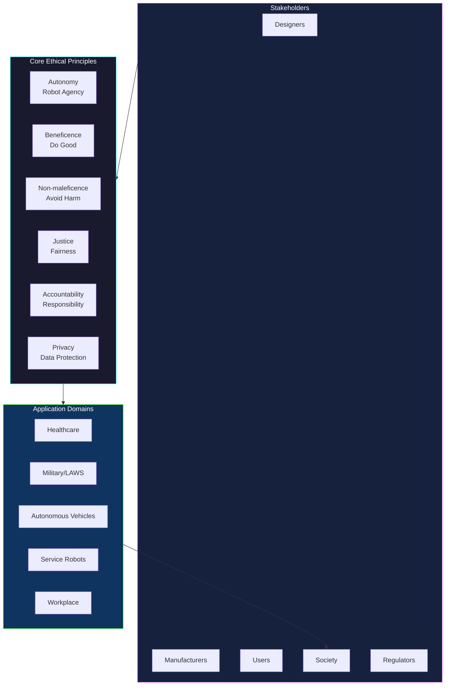
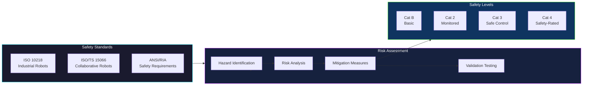

# Module 11: Robot Ethics and Safety

## 11.1 Introduction to Robot Ethics

*   **Defining Robot Ethics:** Explore the philosophical underpinnings of robot ethics, distinguishing it from general AI ethics. Discuss the unique challenges posed by autonomous, embodied agents.
*   **The Need for Ethical Frameworks:** Explain why existing human ethical systems may be insufficient for robotics and the necessity of developing new frameworks tailored to robot capabilities and impact.
*   **Historical Context:** Trace the evolution of ethical thought in robotics, from Asimov's Laws to contemporary debates.
*   **Stakeholders:** Identify key stakeholders in robot ethics, including designers, manufacturers, users, and society at large.

### Robot Ethics Framework

### Safety Standards Hierarchy

## 11.2 Core Ethical Principles in Robotics

*   **Autonomy:** Discuss the ethical implications of increasing robot autonomy, including questions of responsibility, decision-making, and moral agency.
*   **Beneficence and Non-maleficence:** Examine how robots can be designed to do good and avoid harm, focusing on principles of safety, reliability, and positive societal impact.
*   **Justice and Fairness:** Address issues of equitable access to robotics, algorithmic bias in robot decision-making, and the fair distribution of benefits and burdens.
*   **Accountability and Responsibility:** Explore who is morally and legally responsible for robot actions, particularly in cases of error or harm, considering distributed responsibility.
*   **Privacy and Data Security:** Discuss the ethical challenges of robots collecting, processing, and sharing personal data, and the importance of robust security measures.

## 11.3 Robot Safety Standards and Regulations

*   **Understanding Robot Safety:** Define safety in the context of robotics, including physical safety, data security, and psychological well-being.
*   **International Safety Standards (e.g., ISO 10218, ISO/TS 15066):** Detail the key international standards for industrial and collaborative robot safety, explaining their purpose and requirements.
*   **Risk Assessment and Mitigation:** Describe methodologies for identifying, assessing, and mitigating risks associated with robot operation, including fault tree analysis and FMEA.
*   **Regulatory Frameworks:** Examine how different countries and regions are developing legal and regulatory frameworks for robotics, including liability laws and certification processes.
*   **Human-Robot Collaboration Safety:** Focus on the unique safety challenges and solutions for robots working in close proximity with humans, such as speed and separation monitoring, power and force limiting, and hand guiding.

## 11.4 Ethical Challenges in Specific Robot Applications

*   **Healthcare Robots:** Discuss ethical dilemmas in elder care, surgery, and therapy, including patient autonomy, the role of human touch, and data privacy.
*   **Military and Security Robots (Lethal Autonomous Weapons Systems - LAWS):** Debate the ethics of LAWS, the 'human in the loop' vs. 'on the loop' discussion, and the potential for an autonomous arms race.
*   **Service and Companion Robots:** Explore ethical concerns around emotional manipulation, privacy in homes, job displacement, and the impact on human social relationships.
*   **Autonomous Vehicles:** Address ethical considerations in self-driving cars, such as the 'trolley problem,' liability in accidents, and the transition period for mixed traffic.
*   **Workplace Robots:** Examine the ethics of automation's impact on employment, worker surveillance, and the changing nature of human work.

## 11.5 Designing for Ethical and Safe Robots

*   **Ethical AI Design Principles:** Integrate ethical considerations into the robot design process from conception to deployment.
*   **Transparency and Explainability:** Discuss the importance of designing robots whose actions and decisions can be understood and audited by humans.
*   **Robustness and Reliability:** Emphasize the ethical imperative of designing robots that are reliable, predictable, and resilient to failures and unexpected situations.
*   **Human-Centric Design:** Advocate for design approaches that prioritize human well-being, preferences, and values in HRI.
*   **Testing and Validation:** Outline methods for ethically testing robots, including simulation, field trials, and user feedback, ensuring safety and performance in diverse environments.

## 11.6 Societal Impact and Future of Robot Ethics

*   **Economic Impact:** Analyze the broader economic implications of widespread robot adoption, including productivity gains, job creation, and job displacement.
*   **Social and Cultural Impact:** Discuss how robots might reshape human relationships, social norms, and cultural values.
*   **Legal and Policy Implications:** Examine the evolving legal landscape for robotics, including product liability, intellectual property, and international governance.
*   **Public Perception and Acceptance:** Explore factors influencing public trust and acceptance of robots, and strategies for ethical public engagement.
*   **Long-Term Ethical Frameworks:** Consider the future of robot ethics, including potential for robot moral status, interspecies ethics, and the role of robots in shaping humanity's future.
*   **Education and Awareness:** Stress the importance of educating the public, policymakers, and future roboticists about the ethical challenges and responsibilities associated with robotics.

## 11.7 Conclusion: Navigating the Robotic Age

*   Summarize the key ethical challenges and opportunities in robotics.
*   Reiterate the importance of a proactive and interdisciplinary approach to robot ethics and safety.
*   Envision a future where humans and robots co-exist ethically and beneficially.