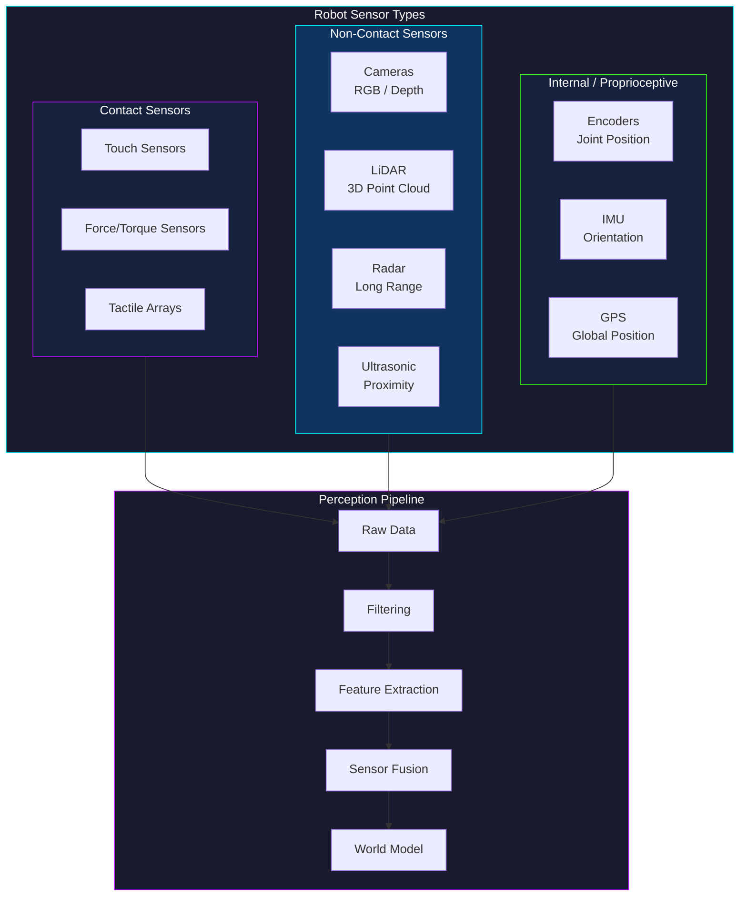
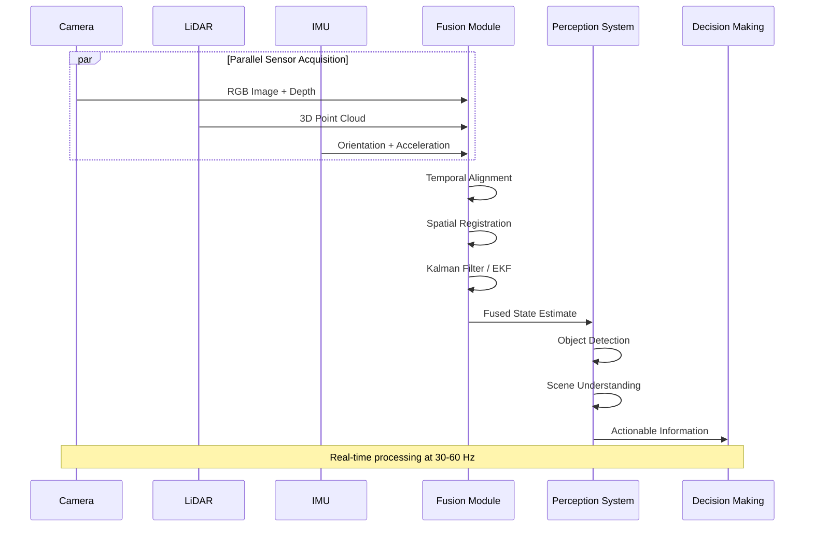

# Module 2: Robot Sensing and Perception

## 1. Introduction to Robot Sensing

Robot sensing and perception are fundamental to enabling autonomous systems to interact intelligently and effectively with their environment. Without the ability to sense, robots would be confined to pre-programmed actions in static, known environments, severely limiting their utility and adaptability.

### Importance of Perception in Robotics
Perception is the process by which robots interpret sensory information to form a meaningful understanding of their surroundings. This understanding is critical for several key robotic capabilities:

*   **Enabling autonomous behavior:** For a robot to operate independently, it must be able to sense its environment, identify obstacles, recognize objects, and locate itself within a given space. This sensory input informs all subsequent autonomous actions, from navigation to complex manipulation tasks.
*   **Interacting with the environment:** Robots often need to physically interact with objects and surfaces. Accurate perception allows them to gauge distances, identify material properties, and apply appropriate forces, ensuring safe and effective interaction.
*   **Decision making:** The quality of a robot's decisions is directly tied to the quality of its perceptual data. Whether it's deciding the optimal path to a goal, choosing the correct tool for a task, or avoiding a collision, robust perception provides the necessary context for intelligent decision-making.

### Sensor Classification Overview

### Sensor Fusion Pipeline

### Overview of Different Types of Sensors
Robot sensors can be broadly categorized based on various characteristics, each offering unique advantages and limitations.

*   **Contact vs. Non-contact sensors:**
    *   **Contact sensors** require physical touch with an object or surface to gather information. Examples include touch sensors, force sensors, and tactile arrays, often used for gripping, object manipulation, or detecting collisions.
    *   **Non-contact sensors** gather information without physical interaction. This category includes vision systems (cameras), lidar, radar, ultrasonic sensors, and proximity sensors, which are crucial for navigation, obstacle detection, and remote object identification.

*   **Active vs. Passive sensors:**
    *   **Active sensors** emit energy (e.g., light, sound waves, radio waves) into the environment and then measure the reflected or returned energy to gather information. Examples include lidar (laser light), radar (radio waves), and ultrasonic sensors (sound waves).
    *   **Passive sensors** detect and measure existing energy or phenomena in the environment without emitting their own. Cameras (detecting ambient light) and microphones (detecting sound) are prime examples of passive sensors.

*   **Internal vs. External sensors:**
    *   **Internal sensors (proprioceptive sensors)** measure the robot's own state, such as joint angles, motor speeds, and internal forces. Encoders and IMUs (Inertial Measurement Units) are common proprioceptive sensors. They provide crucial feedback for controlling the robot's own movement and configuration.
    *   **External sensors (exteroceptive sensors)** gather information about the robot's surrounding environment. This includes cameras, lidar, radar, and force/torque sensors that interact with the external world. These sensors enable the robot to understand its position relative to objects, detect obstacles, and perceive the layout of its workspace.

## 2. Vision Systems

Vision systems are arguably the most powerful and versatile sensors in robotics, mimicking human sight to provide rich, detailed information about the environment.

### Cameras
Cameras are fundamental components of robot vision systems, offering different capabilities based on their configuration.

*   **Monocular Cameras: Principles, applications, limitations:**
    *   **Principles:** A monocular camera captures a 2D image of a 3D scene. The image formed is a projection of the 3D world onto a 2D sensor plane.
    *   **Applications:** Object detection and recognition, feature tracking, visual servoing (using visual feedback to control robot motion), basic navigation, and qualitative scene understanding.
    *   **Limitations:** A single monocular camera cannot directly measure depth or distance to objects. This information must be inferred using various computer vision algorithms, which can be computationally intensive and less accurate than direct depth measurement.

*   **Stereo Cameras: Depth perception, triangulation, disparity maps:**
    *   **Principles:** A stereo camera system consists of two (or more) monocular cameras placed at a fixed, known distance apart, similar to human eyes. By capturing two images of the same scene from slightly different viewpoints, the system can triangulate the position of objects in 3D space.
    *   **Depth Perception:** The difference in the apparent position of an object in the left and right images is called **disparity**. The greater the disparity, the closer the object.
    *   **Triangulation:** Geometric principles are used to calculate the 3D coordinates of points based on their 2D positions in both images and the known camera parameters.
    *   **Disparity Maps:** A disparity map is an image where each pixel's value represents the disparity (and thus depth) of the corresponding point in the scene.
    *   **Applications:** 3D reconstruction, precise object localization, obstacle avoidance, grasping, and navigation where depth information is critical.

*   **Depth Cameras (e.g., ToF, Structured Light): Principles, advantages, limitations:**
    *   **Principles:** Depth cameras directly measure the distance to objects in the scene, providing a 3D point cloud or depth map.
        *   **Time-of-Flight (ToF) Cameras:** Emit modulated light (e.g., infrared) and measure the time it takes for the light to return to the sensor. The time delay is directly proportional to the distance.
        *   **Structured Light Cameras:** Project a known pattern of light (e.g., lines, grids) onto the scene. Distortions in the captured pattern are then analyzed by a camera to calculate depth.
    *   **Advantages:** Provide direct and accurate depth information, often robust to lighting changes (especially ToF and active structured light), and can operate in low-light conditions.
    *   **Limitations:** Range limitations, susceptibility to interference from other light sources (e.g., sunlight for structured light), and resolution can be lower than traditional cameras.

### Image Processing Fundamentals
Once an image is captured, various image processing techniques are applied to extract useful information.

*   **Image representation (pixels, color spaces):**
    *   **Pixels:** Digital images are composed of a grid of picture elements (pixels), each representing a specific color and intensity.
    *   **Color Spaces:** Images can be represented in various color spaces, such as RGB (Red, Green, Blue), which is common for display, or grayscale (intensity only), which simplifies many processing tasks. Other color spaces like HSV (Hue, Saturation, Value) or YCbCr are useful for specific applications.

*   **Basic operations: filtering, enhancement, edge detection:**
    *   **Filtering:** Operations to modify pixel values based on their neighborhood. Common filters include:
        *   **Smoothing/Blurring filters (e.g., Gaussian, median):** Used to reduce noise and blur sharp edges.
        *   **Sharpening filters:** Enhance fine details and edges.
    *   **Enhancement:** Adjusting image properties like contrast, brightness, and color to improve visual quality or highlight specific features.
    *   **Edge Detection (e.g., Canny, Sobel, Prewitt):** Algorithms to identify discontinuities in image intensity, which often correspond to object boundaries. Edges are crucial for object recognition, segmentation, and feature extraction.

*   **Morphological operations:**
    *   Set-theory based operations applied to binary images (black and white). Common operations include:
        *   **Erosion:** Shrinks boundaries of foreground objects, removes small spurious objects.
        *   **Dilation:** Expands boundaries of foreground objects, fills small holes.
        *   **Opening:** Erosion followed by dilation; removes small objects and smooths contours.
        *   **Closing:** Dilation followed by erosion; fills small holes and connects broken parts.
    *   **Applications:** Noise removal, object shape analysis, and preparing images for further processing.

### Feature Extraction
Feature extraction involves identifying and describing distinctive points or regions in an image that are robust to changes in viewpoint, lighting, and scale.

*   **Corners, blobs, edges:**
    *   **Corners:** Points where two or more edges meet, characterized by high intensity variation in multiple directions (e.g., Harris corner detector).
    *   **Blobs:** Regions of interest that are distinct from their surroundings in terms of brightness or color (e.g., Laplacian of Gaussian, Difference of Gaussians).
    *   **Edges:** Boundaries between regions of different intensity or color, as identified by edge detection algorithms.

*   **Feature descriptors (e.g., SIFT, SURF, ORB):**
    *   Once features are detected, **feature descriptors** are computed to provide a unique "fingerprint" for each feature. These descriptors are designed to be invariant or robust to image transformations.
    *   **SIFT (Scale-Invariant Feature Transform):** A highly robust descriptor, invariant to scale, rotation, and partially invariant to changes in illumination and viewpoint.
    *   **SURF (Speeded Up Robust Features):** A faster alternative to SIFT, offering similar robustness.
    *   **ORB (Oriented FAST and Rotated BRIEF):** A more computationally efficient and patented-free alternative, particularly useful for real-time applications.

*   **Applications in object recognition and tracking:**
    *   Feature descriptors are used to match features across different images, enabling:
        *   **Object Recognition:** Identifying known objects in a scene by matching their features with a database of learned object features.
        *   **Object Tracking:** Following the movement of specific objects across a sequence of images or video frames.
        *   **Image Stitching and Panoramas:** Aligning multiple images to create a larger composite image.
        *   **Localization and Mapping (SLAM):** Identifying corresponding features in successive camera frames to estimate the robot's pose and build a map of the environment.

## 3. Lidar and Radar

Lidar and radar are active sensing technologies that provide valuable distance and environmental mapping information, particularly useful for autonomous navigation and obstacle avoidance.

### Lidar (Light Detection and Ranging)
Lidar systems use laser light to measure distances, creating highly accurate 3D representations of the environment.

*   **Principles: Time-of-flight, laser scanning:**
    *   **Time-of-Flight:** A lidar sensor emits short pulses of laser light. It then measures the time it takes for each pulse to travel to a target and reflect back to the sensor. Since the speed of light is known, the distance to the target can be precisely calculated.
    *   **Laser Scanning:** Lidar units often incorporate rotating mirrors or multiple laser emitters/receivers to scan a wide field of view, generating thousands or millions of distance measurements per second. This creates a dense collection of 3D points known as a **point cloud**.

*   **Applications: Mapping, localization (SLAM), obstacle avoidance:**
    *   **Mapping:** Lidar is excellent for creating detailed 2D or 3D maps of environments, both indoors and outdoors.
    *   **Localization (SLAM - Simultaneous Localization and Mapping):** Robots use lidar data to simultaneously build a map of an unknown environment and determine their own position within that map.
    *   **Obstacle Avoidance:** The precise depth information from lidar allows robots to detect and localize obstacles with high accuracy, enabling safe navigation and path planning.
    *   **Object Detection and Classification:** By analyzing the shape and density of point clouds, objects like vehicles, pedestrians, and static structures can be detected and classified.

*   **Point Cloud Data Processing: Filtering, segmentation, registration:**
    *   **Filtering:** Raw lidar point clouds often contain noise. Filtering techniques (e.g., statistical outlier removal, voxel grid downsampling) are used to remove spurious points and reduce data density for efficient processing.
    *   **Segmentation:** Grouping points in the cloud that belong to the same object or surface. For example, segmenting ground planes from elevated objects, or individual cars from a cluttered scene.
    *   **Registration:** Aligning multiple point clouds captured from different viewpoints or at different times into a common coordinate system. This is crucial for building larger maps or tracking changes over time (e.g., Iterative Closest Point - ICP algorithm).

### Radar (Radio Detection and Ranging)
Radar systems use radio waves to detect objects and measure their range, velocity, and angle.

*   **Principles: Doppler effect, electromagnetic waves:**
    *   **Electromagnetic Waves:** Radar systems transmit electromagnetic waves (radio waves) and listen for reflections (echoes) from objects.
    *   **Doppler Effect:** When an object is moving relative to the radar, the frequency of the reflected waves changes (Doppler shift). This shift allows radar to measure the relative velocity of objects.
    *   **Range Measurement:** Similar to lidar, range is determined by measuring the time delay between transmitting a pulse and receiving its echo.

*   **Applications: Long-range detection, adverse weather conditions:**
    *   **Long-range Detection:** Radar typically has a much longer range than lidar, making it suitable for high-speed applications like autonomous vehicles on highways.
    *   **Adverse Weather Conditions:** Radio waves are less affected by fog, rain, snow, and dust than laser light, giving radar a significant advantage in harsh weather.
    *   **Velocity Measurement:** The Doppler effect makes radar excellent for accurately measuring the speed of moving objects.
    *   **Blind Spot Monitoring, Adaptive Cruise Control:** Common applications in automotive safety systems.

*   **Comparison with Lidar: Strengths and weaknesses:**
    *   **Lidar Strengths:** High angular resolution, precise 3D mapping, excellent for short-to-medium range, detailed environmental modeling.
    *   **Lidar Weaknesses:** Performance degradation in adverse weather (rain, fog, snow), typically higher cost, can be affected by ambient light.
    *   **Radar Strengths:** Robust in adverse weather conditions, long-range detection, accurate velocity measurement, typically lower cost.
    *   **Radar Weaknesses:** Lower angular resolution (less detailed "image"), difficulty in distinguishing small objects close together, can suffer from clutter and false positives.
    *   **Complementary Nature:** Due to their complementary strengths, lidar and radar are often used together in autonomous systems, with sensor fusion techniques combining their data for a more robust and complete perception.

## 4. Force and Torque Sensors

Force and torque sensors allow robots to "feel" their interaction with the environment, providing critical feedback for manipulation, assembly, and safe human-robot interaction.

### Principles of Force and Torque Measurement
These sensors convert mechanical force or torque into an electrical signal.

*   **Strain gauges, piezoelectric sensors:**
    *   **Strain Gauges:** The most common type of force sensor. They consist of a resistive material bonded to a deformable structure. When force is applied, the structure deforms, causing a change in the strain gauge's electrical resistance, which can be measured and correlated to the applied force.
    *   **Piezoelectric Sensors:** These sensors generate an electrical charge when subjected to mechanical stress or deformation. They are highly sensitive and can respond quickly to dynamic forces, but typically measure only dynamic forces, not static ones.

*   **Multi-axis force/torque sensors:**
    *   These specialized sensors can measure forces along three orthogonal axes (Fx, Fy, Fz) and torques around these three axes (Tx, Ty, Tz) simultaneously. They typically consist of a compliant structure instrumented with multiple strain gauges, arranged to decouple the different force and torque components.
    *   **Applications:** Precisely controlling robot end-effectors, intricate assembly tasks, and applications requiring fine motor control and interaction sensing.

### Applications
Force and torque sensing significantly enhances a robot's capabilities in various domains.

*   **Haptic Feedback: Enabling robots to "feel":**
    *   Force sensors can provide a sense of touch to robot grippers or tools. This haptic feedback allows the robot to detect contact, assess object stiffness, and prevent excessive force that could damage objects or the robot itself.
    *   In teleoperation, haptic feedback can transmit the feel of remote interactions back to a human operator, enhancing dexterity and control.

*   **Manipulation: Grasping, object handling, assembly:**
    *   **Grasping:** Force sensors in grippers enable adaptive grasping, where the robot can adjust its grip force based on the object's properties (e.g., fragility, weight, slipperiness), ensuring secure yet gentle handling.
    *   **Object Handling:** For delicate or deformable objects, force control ensures that the robot manipulates them without crushing or deforming them.
    *   **Assembly:** In precision assembly tasks, force feedback allows robots to detect misalignments, apply insertion forces, and verify successful part mating, reducing errors and damage.

*   **Human-Robot Interaction: Safety, collaborative tasks:**
    *   **Safety:** Force sensors are critical for safe human-robot collaboration. If a robot detects an unexpected force (e.g., contact with a human), it can immediately stop or retreat, preventing injuries.
    *   **Collaborative Tasks:** In shared workspaces, force/torque sensors allow humans to guide robots manually (e.g., through lead-through programming) or to work side-by-side on tasks requiring both human dexterity and robotic strength, where the robot can adapt its motion based on human input forces.

## 5. Proprioceptive Sensors

Proprioceptive sensors provide information about the internal state of the robot itself, such as the position of its joints, the speed of its motors, and its overall orientation. This "self-awareness" is crucial for precise control and stable operation.

### Encoders
Encoders are sensors used to measure the angular or linear position, velocity, or acceleration of a rotating shaft or linear movement.

*   **Rotary and Linear Encoders: Principles, types (absolute, incremental):**
    *   **Rotary Encoders:** Convert angular motion into an electrical signal. They are commonly attached to motor shafts or robot joints.
    *   **Linear Encoders:** Measure linear displacement.
    *   **Principles:** Both types typically use optical, magnetic, or capacitive methods to detect changes.
    *   **Incremental Encoders:** Provide a stream of pulses as the shaft rotates or moves linearly. The control system counts these pulses to determine displacement and estimates velocity from the rate of pulses. They require a home position reference.
    *   **Absolute Encoders:** Provide a unique digital code for each position. This means they retain their position information even after power loss and do not need to be re-homed.
    *   **Applications:** Crucial for closed-loop control of motors and joints, allowing robots to know their exact configuration.

*   **Applications: Joint position sensing, motor control:**
    *   **Joint Position Sensing:** In robotic arms and manipulators, encoders on each joint provide the precise angle of rotation, which is essential for determining the robot's end-effector position and orientation (forward kinematics) and for planning desired movements (inverse kinematics).
    *   **Motor Control:** Encoders are used in servo and stepper motor systems to provide feedback on the motor's speed and position, allowing for accurate and stable motor control.

### Inertial Measurement Units (IMUs)
An IMU is an electronic device that measures and reports a body's specific force, angular rate, and sometimes the magnetic field surrounding the body, using a combination of accelerometers, gyroscopes, and magnetometers.

*   **Accelerometers: Measuring linear acceleration:**
    *   **Principles:** Measure non-gravitational acceleration. They typically consist of a seismic mass suspended by springs, and its displacement due to acceleration is measured using capacitive or piezoelectric means.
    *   **Output:** Provides linear acceleration along one or more axes (e.g., x, y, z).
    *   **Applications:** Detecting changes in linear motion, vibration analysis, and providing input for position estimation through integration (though integration accumulates drift).

*   **Gyroscopes: Measuring angular velocity:**
    *   **Principles:** Measure the rate of rotation (angular velocity) around an axis. Modern MEMS (Micro-Electro-Mechanical Systems) gyroscopes often use the Coriolis effect to detect angular motion.
    *   **Output:** Provides angular velocity along one or more axes (e.g., pitch, roll, yaw rates).
    *   **Applications:** Measuring rotational motion, helping maintain robot stability and orientation, and contributing to heading estimation.

*   **Magnetometers: Measuring magnetic field (for orientation):**
    *   **Principles:** Measure the strength and direction of the surrounding magnetic field. When calibrated, they can detect the Earth's magnetic field, acting as a digital compass.
    *   **Output:** Provides magnetic field strength along one or more axes.
    *   **Applications:** Providing an absolute reference for heading or yaw orientation, especially when gyroscopes drift over time, and correcting for sensor drift in navigation systems.

*   **Applications: Robot orientation, balance, navigation:**
    *   **Robot Orientation:** By fusing data from accelerometers and gyroscopes (and magnetometers), an IMU can provide a robust estimate of the robot's orientation in 3D space (roll, pitch, yaw).
    *   **Balance:** Critical for legged robots and drones to maintain stability and balance.
    *   **Navigation:** IMUs are a core component of inertial navigation systems, providing dead reckoning capabilities (estimating position by integrating velocity and acceleration over time). Although they suffer from drift over long periods, they are excellent for short-term, high-frequency motion sensing and are often fused with GPS or other external sensors.

### Joint Position Sensing
Beyond encoders, other sensors contribute to precise joint position sensing.

*   **Potentiometers, resolvers:**
    *   **Potentiometers:** Variable resistors that provide an analog voltage proportional to angular or linear displacement. Simple and inexpensive, but can be prone to wear and noise.
    *   **Resolvers:** Electromagnetic transducers that measure angular position. They are robust, highly accurate, and resistant to harsh environments, often used in high-performance industrial robots.
    *   **Feedback in robotic arms and manipulators:** These sensors provide direct feedback on the absolute position of joints, enabling precise control of robotic arms for tasks requiring high accuracy and repeatability. They often serve as a redundant or complementary sensing mechanism to encoders.

## 6. Sensor Fusion

Sensor fusion is the process of combining data from multiple sensors to achieve a more accurate, reliable, and comprehensive understanding of the robot's state and environment than would be possible with individual sensors alone.

### Concept and Importance
*   **Combining data from multiple sensors:** In robotics, it's common to use a diverse set of sensors (e.g., cameras, lidar, IMUs, encoders, GPS). Each sensor has its own strengths and weaknesses, measurement noise characteristics, and spatial/temporal resolution.
*   **Overcoming individual sensor limitations:**
    *   Cameras provide rich visual detail but struggle with depth and are sensitive to lighting.
    *   Lidar gives precise depth but lacks color information and can be affected by weather.
    *   IMUs provide high-frequency motion data but suffer from drift over time.
    *   GPS offers global position but can be inaccurate or unavailable indoors.
    By intelligently combining these disparate data streams, the limitations of one sensor can be compensated by the strengths of another.
*   **Improving robustness and accuracy:** Sensor fusion leads to a more robust system that is less susceptible to the failure or temporary inaccuracies of a single sensor. The combined estimate is typically more accurate and stable than any single sensor's measurement.
*   **Creating a richer state estimate:** Fusion allows for the estimation of variables that no single sensor can provide independently (e.g., a robot's 6D pose, combined with a dense 3D map of its surroundings, and the velocities of dynamic objects).

### Techniques for Sensor Fusion
Various algorithms are employed for sensor fusion, ranging from simple averaging to complex probabilistic models.

*   **Kalman Filters: Principles, Extended Kalman Filter (EKF), Unscented Kalman Filter (UKF):**
    *   **Principles:** The Kalman filter is an optimal estimator that uses a series of measurements observed over time, containing noise and other inaccuracies, and produces estimates of unknown variables that tend to be more precise than those based on a single measurement alone. It operates in a predict-update cycle. It assumes linear system dynamics and Gaussian noise.
    *   **Extended Kalman Filter (EKF):** An extension for non-linear systems. It linearizes the system dynamics and measurement models around the current state estimate using Jacobian matrices. While widely used, EKF can suffer from linearization errors.
    *   **Unscented Kalman Filter (UKF):** Addresses the linearization issues of EKF by using a deterministic sampling technique (unscented transform) to choose a set of sample points (sigma points) around the mean. These points are then propagated through the non-linear functions, capturing the posterior mean and covariance more accurately. UKF generally performs better than EKF for highly non-linear systems.
    *   **Applications:** Robot localization (fusing IMU, wheel odometry, GPS), object tracking, state estimation in dynamic systems.

*   **Particle Filters:**
    *   **Principles:** Non-parametric filters that represent the probability distribution of the robot's state using a set of weighted random samples (particles). Each particle represents a possible state of the robot. As new sensor measurements arrive, the weights of the particles are updated based on how well they explain the measurement, and particles are resampled.
    *   **Applications:** Highly effective for non-linear and non-Gaussian systems, particularly in situations with ambiguous sensor readings or where the robot might be "lost" and needs to re-localize (e.g., Monte Carlo Localization - MCL).

*   **Complementary Filters:**
    *   **Principles:** Simple and computationally efficient filters often used to combine data from two sensors with complementary characteristics, such as an accelerometer (good for low-frequency orientation, but noisy) and a gyroscope (good for high-frequency orientation, but drifts). They essentially use a low-pass filter on one sensor and a high-pass filter on the other, then sum the results.
    *   **Applications:** Common in IMU-based orientation estimation for drones and mobile robots due to their simplicity and real-time performance.

*   **Probabilistic approaches:**
    *   Many sensor fusion techniques, including Kalman and particle filters, are rooted in probabilistic frameworks (e.g., Bayesian inference). These approaches explicitly model uncertainty and propagate probabilities, providing robust estimates even with noisy or incomplete data. Other probabilistic methods include Gaussian Processes and various forms of graphical models.

## 7. Perception Algorithms

Perception algorithms transform raw sensor data into meaningful information that robots can use for tasks like navigation, manipulation, and interaction. These algorithms often leverage advances in machine learning, particularly deep learning.

### Object Detection
Identifying and localizing objects within an image or point cloud.

*   **Traditional methods (e.g., Viola-Jones):**
    *   **Principles:** Early methods often used handcrafted features (e.g., Haar-like features for Viola-Jones) and machine learning classifiers (e.g., AdaBoost) trained on large datasets.
    *   **Viola-Jones Algorithm:** Famous for real-time face detection, it uses integral images for rapid feature computation and a cascade of classifiers to quickly discard non-object regions.
    *   **Limitations:** Limited to specific object types, sensitive to variations in pose, lighting, and occlusion, and requires extensive feature engineering.

*   **Deep Learning-based methods (e.g., R-CNN, YOLO, SSD):**
    *   **Principles:** Convolutional Neural Networks (CNNs) automatically learn hierarchical features from raw image data, eliminating the need for manual feature engineering. These methods have revolutionized object detection.
    *   **R-CNN (Region-based Convolutional Neural Network) family (Fast R-CNN, Faster R-CNN):** These are two-stage detectors. First, they propose regions of interest (RoIs) where objects might be located, and then classify these regions and refine their bounding boxes. Known for high accuracy.
    *   **YOLO (You Only Look Once):** A single-stage detector that predicts bounding boxes and class probabilities directly from the full image in a single forward pass. Known for its incredible speed, making it suitable for real-time applications.
    *   **SSD (Single Shot Detector):** Another single-stage detector that balances speed and accuracy by using a network of different-sized convolutional layers to detect objects at multiple scales.
    *   **Applications:** Autonomous driving, industrial automation, surveillance, human-robot interaction, visual inspection.

### Object Tracking
Following the movement of detected objects over time.

*   **Kalman filters, particle filters:**
    *   **Principles:** As discussed in sensor fusion, these filters can be used to predict the future state of an object based on its past motion and then update the prediction with new sensor measurements (e.g., detections from an object detector).
    *   **Applications:** Tracking individual vehicles, pedestrians, or manipulated objects in real-time.

*   **Deep SORT, SORT:**
    *   **SORT (Simple Online and Realtime Tracking):** A classic and highly efficient tracking algorithm that uses Kalman filters for motion prediction and the Hungarian algorithm for data association (matching detected objects to existing tracks).
    *   **Deep SORT:** An extension of SORT that incorporates deep learning features (e.g., appearance embeddings from a re-identification CNN) to improve data association, making it more robust to occlusions and identity switches.
    *   **Applications:** Multi-object tracking in complex scenes, particularly for autonomous vehicles and surveillance.

### Segmentation
Dividing an image into meaningful regions or objects.

*   **Semantic Segmentation: Pixel-level classification:**
    *   **Principles:** Assigns a class label (e.g., "road," "car," "sky," "person") to every single pixel in an image. The output is a mask where each pixel's color corresponds to its semantic class.
    *   **Deep Learning Models:** Typically uses fully convolutional networks (FCNs) or encoder-decoder architectures (e.g., U-Net, DeepLab).
    *   **Applications:** Scene understanding for autonomous vehicles, medical image analysis, terrain analysis for ground robots.

*   **Instance Segmentation: Detecting and segmenting individual objects:**
    *   **Principles:** Goes a step further than semantic segmentation by not only classifying pixels but also identifying individual instances of objects. For example, it would differentiate between "car 1," "car 2," and "car 3," even if they are of the same class.
    *   **Deep Learning Models:** Mask R-CNN is a prominent example, extending Faster R-CNN to predict a segmentation mask for each detected object in addition to its bounding box and class label.
    *   **Applications:** Fine-grained object manipulation, inventory management, precise interaction with multiple identical objects.

### Pose Estimation
Estimating the 6D pose (position and orientation) of objects.

*   **Estimating 6D pose (position and orientation) of objects:**
    *   **Principles:** Determines an object's precise 3D position (x, y, z) and its 3D orientation (roll, pitch, yaw) relative to a camera or robot coordinate system. This is crucial for tasks requiring precise interaction.
    *   **Techniques:** Can involve matching 2D image features to a 3D model of the object, using deep learning regression models, or leveraging depth sensor data.
    *   **Applications in manipulation and navigation:**
        *   **Manipulation:** For robotic arms to grasp or insert objects accurately, they need to know the object's exact 6D pose.
        *   **Navigation:** Understanding the pose of crucial landmarks or docking stations.
        *   **Augmented Reality:** Accurately placing virtual objects in a real-world scene.

## 8. Challenges in Robot Perception

Despite significant advancements, robot perception still faces several complex challenges that engineers and researchers are continuously working to overcome.

### Sensor Noise and Uncertainty
All sensors are imperfect and introduce some level of error or noise into their measurements.

*   **Sources of noise:**
    *   **Electronic noise:** Inherent to sensor electronics.
    *   **Environmental factors:** Temperature, humidity, vibration can affect sensor readings.
    *   **Measurement limitations:** Finite resolution, latency, calibration errors.
    *   **Quantization noise:** Converting analog signals to digital values.
*   **Techniques for noise reduction:**
    *   **Filtering:** Digital filters (e.g., low-pass, median, Kalman filters) applied to sensor data.
    *   **Sensor fusion:** Combining multiple noisy measurements to get a more accurate estimate.
    *   **Calibration:** Precisely calibrating sensors to minimize systematic errors.
    *   **Hardware improvements:** Using higher quality sensors and better shielding.

### Occlusion
Occlusion occurs when part of an object or the entire object is hidden from the sensor's view by another object.

*   **Partial and full occlusion:**
    *   **Partial occlusion:** Only a portion of the object is visible.
    *   **Full occlusion:** The object is completely hidden.
*   **Strategies for handling occluded objects:**
    *   **Predictive models:** Using motion models (e.g., Kalman filters) to predict the occluded object's position.
    *   **Multi-view perception:** Using multiple cameras or sensors from different viewpoints.
    *   **Contextual reasoning:** Inferring the presence and location of occluded objects based on the surrounding visible scene.
    *   **Deep learning:** Advanced object detection and tracking models are becoming more robust to partial occlusion by learning robust features.

### Varying Lighting Conditions
Vision systems, especially passive cameras, are highly sensitive to changes in illumination.

*   **Impact on vision systems:**
    *   **Shadows:** Can be misinterpreted as objects or cause features to disappear.
    *   **Glare and reflections:** Can obscure details or create false features.
    *   **Low light:** Reduces image quality and makes feature extraction difficult.
    *   **Strong sunlight:** Can cause saturation and loss of detail.
*   **Techniques for robust perception in different lighting:**
    *   **High Dynamic Range (HDR) imaging:** Capturing multiple exposures and combining them to preserve detail in both bright and dark areas.
    *   **Active illumination:** Using structured light or infrared illuminators (common in depth cameras) to control lighting.
    *   **Image preprocessing:** Techniques like gamma correction, histogram equalization.
    *   **Robust deep learning models:** Training models on diverse datasets with varying lighting conditions.
    *   **Sensor fusion:** Combining vision with lidar or radar, which are less affected by light.

### Dynamic Environments
Robots often operate in environments where objects, people, or even the environment itself are constantly changing.

*   **Dealing with moving objects and changing scenes:**
    *   **Challenges:** Distinguishing static elements from dynamic ones, predicting the future motion of moving objects, updating environmental maps in real-time.
    *   **Strategies:**
        *   **Object tracking algorithms:** To follow dynamic entities.
        *   **Motion estimation:** Using optical flow or scene flow to analyze movement.
        *   **Dynamic SLAM:** Mapping algorithms that can handle and explicitly model moving objects.
        *   **Predictive control:** Incorporating predictions of dynamic object trajectories into path planning.

### Computational Constraints
Perception algorithms, especially those based on deep learning or processing large point clouds, can be computationally intensive.

*   **Real-time processing requirements:** For autonomous robots, perception data must be processed quickly enough to enable real-time decision-making and control (e.g., obstacle avoidance for a fast-moving drone).
*   **Optimization of perception algorithms:**
    *   **Efficient algorithms:** Developing algorithms that require fewer computations.
    *   **Hardware acceleration:** Utilizing GPUs, FPGAs, and specialized AI accelerators.
    *   **Model compression/quantization:** Reducing the size and complexity of deep learning models for deployment on edge devices.
    *   **Distributed computing:** Spreading computational load across multiple processors.
    *   **Event-based processing:** For event cameras, processing only relevant changes in the scene rather than full frames.

## 9. Future Trends in Sensing

The field of robot sensing and perception is continually evolving, driven by new sensor technologies and advancements in artificial intelligence.

### Advanced Sensor Technologies
Innovations in sensor hardware are paving the way for more sophisticated perception capabilities.

*   **Event cameras:**
    *   **Principles:** Unlike traditional cameras that capture frames at a fixed rate, event cameras (also known as neuromorphic cameras or dynamic vision sensors - DVS) report pixel-level intensity changes asynchronously and independently. Each "event" signifies a change in brightness at a specific pixel location and time.
    *   **Advantages:** Extremely low latency, very high dynamic range, and high power efficiency, as they only transmit data when something changes.
    *   **Applications:** High-speed motion tracking, low-light vision, tracking fast-moving objects, and situations where latency is critical.

*   **Hyperspectral imaging:**
    *   **Principles:** Captures image data across a wide range of the electromagnetic spectrum, far beyond the visible light perceived by human eyes or standard RGB cameras. Each pixel contains a continuous spectrum of light, allowing for detailed material analysis.
    *   **Advantages:** Can differentiate materials that look identical in visible light, identify chemical compositions, and detect subtle environmental changes.
    *   **Applications:** Agriculture (crop health), food inspection, medical diagnostics, remote sensing, and potentially identifying material properties for robotic manipulation.

*   **Tactile sensors with high resolution:**
    *   **Principles:** Mimic the human sense of touch with arrays of tiny sensors that can detect pressure, shear forces, temperature, and even texture. Advanced tactile sensors use technologies like capacitance, optics (e.g., GelSight), or piezoresistive materials.
    *   **Advantages:** Provide fine-grained information about contact interactions, essential for delicate manipulation, surface texture recognition, and precise feedback during grasping.
    *   **Applications:** Surgical robots, human-robot collaboration, assembly of fragile components, and advanced prosthetic hands.

### AI-driven Perception
The integration of artificial intelligence, particularly deep learning, is transforming how robots perceive and understand their world.

*   **End-to-end learning for perception:**
    *   **Principles:** Instead of breaking down the perception pipeline into separate stages (e.g., feature extraction, object detection, tracking), end-to-end learning uses deep neural networks to directly map raw sensor inputs to high-level outputs (e.g., directly predicting robot actions or complete scene understanding) without explicit intermediate representations.
    *   **Advantages:** Can learn highly complex and non-linear relationships, potentially leading to better performance by optimizing the entire pipeline.
    *   **Limitations:** Requires vast amounts of data, can be difficult to interpret or debug, and might struggle with out-of-distribution data.

*   **Reinforcement learning for active sensing:**
    *   **Principles:** Applying reinforcement learning (RL) to train robots not just to process sensor data, but to actively decide *how* and *when* to acquire sensory information. An RL agent can learn optimal strategies for camera placement, object manipulation (e.g., rotating an object to get a better view), or sensor movement to reduce uncertainty or improve task performance.
    *   **Advantages:** Enables intelligent and adaptive sensing behaviors, making perception more efficient and goal-oriented.
    *   **Applications:** Robotic inspection, intelligent grasping, autonomous exploration, and active information gathering.

*   **Generative models for perception enhancement:**
    *   **Principles:** Generative Adversarial Networks (GANs) and Variational Autoencoders (VAEs) can be used to generate synthetic sensor data or to enhance real sensor data. This includes tasks like:
        *   **Inpainting:** Filling in occluded regions in images or point clouds.
        *   **Super-resolution:** Enhancing the resolution of low-quality sensor data.
        *   **Domain adaptation:** Bridging the gap between simulated and real-world sensor data.
        *   **Data augmentation:** Creating diverse training data for other perception tasks.
    *   **Advantages:** Can improve the robustness of perception systems, especially in challenging conditions or with limited real-world data.
    *   **Applications:** Robust perception in adverse conditions, synthetic data generation for training, and improving the quality of sensor inputs.
