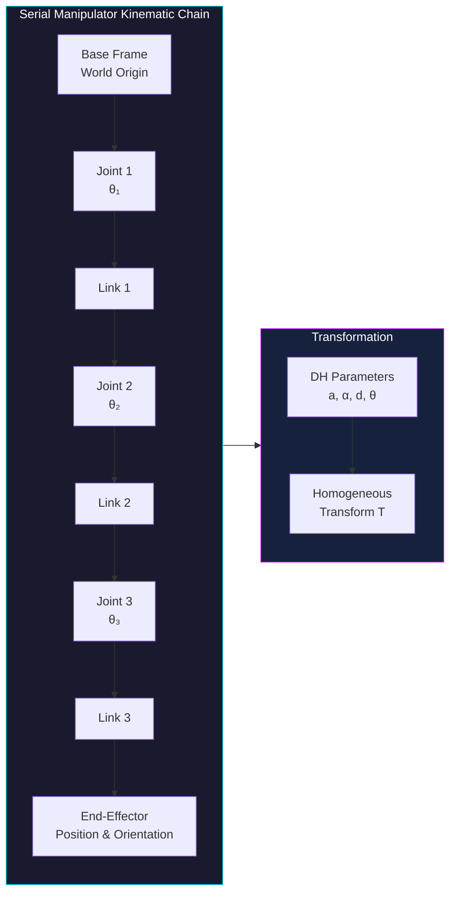

# Module 3: Robot Kinematics and Dynamics

## 1. Introduction to Kinematics and Dynamics

### 1.1. Definitions

#### 1.1.1. Kinematics: The Geometry of Motion

Kinematics is the branch of mechanics that describes the motion of points, bodies, and systems of bodies without considering the forces that cause the motion. In robotics, kinematics focuses on the geometric relationships between the joint angles of a robot and the position and orientation of its end-effector. It answers questions like: "Given the joint angles, where is the robot's hand in space?" or "What joint angles are needed to reach a specific point?"

#### 1.1.2. Dynamics: The Forces Behind Motion

Dynamics, in contrast, is the study of motion while considering the forces and torques that cause or affect that motion. In robotics, dynamics deals with the relationship between the forces and torques applied to a robot's joints and the resulting motion of its links. This includes understanding inertia, gravity, friction, and other external forces. Dynamics answers questions like: "What forces are required at each joint to achieve a desired acceleration of the end-effector?"

### Kinematics vs Dynamics Overview

```mermaid
flowchart LR
    subgraph Kinematics["Kinematics (Geometry)"]
        direction TB
        FK[Forward Kinematics<br/>Joints → End-Effector]
        IK[Inverse Kinematics<br/>End-Effector → Joints]
        JAC[Jacobian<br/>Velocity Mapping]
    end

    subgraph Dynamics["Dynamics (Forces)"]
        direction TB
        FD[Forward Dynamics<br/>Torques → Acceleration]
        ID[Inverse Dynamics<br/>Acceleration → Torques]
        DYN[Dynamic Model<br/>M(q)q̈ + C(q,q̇)q̇ + g(q) = τ]
    end

    subgraph Control["Motion Control"]
        TC[Trajectory Control]
        FC[Force Control]
        IC[Impedance Control]
    end

    FK --> JAC
    IK --> JAC
    JAC --> FD
    JAC --> ID
    FD & ID --> DYN
    DYN --> TC & FC & IC

    style Kinematics fill:#1a1a2e,stroke:#00f3ff,color:#fff
    style Dynamics fill:#16213e,stroke:#bc13fe,color:#fff
    style Control fill:#0f3460,stroke:#39ff14,color:#fff
```

### Robot Arm Kinematic Chain



### 1.2. Importance in Robotics

Kinematics and dynamics are foundational to nearly every aspect of robotics.

#### 1.2.1. Robot Design and Control

Understanding kinematics and dynamics is crucial for designing robots that can perform specific tasks. For example, the length of a robot arm's links and the range of motion of its joints (kinematics) directly impact its workspace and dexterity. Dynamically, knowing how forces propagate through the robot helps in selecting appropriate motors and actuators and in designing control algorithms that ensure stable and precise movements.

#### 1.2.2. Trajectory Planning and Execution

For a robot to move from one point to another, its path must be carefully planned. Kinematics allows us to plan trajectories in the robot's joint space or in the Cartesian space of its end-effector. Dynamics ensures that these planned trajectories can be executed by the robot's physical system, taking into account limits on joint velocities, accelerations, and actuator torques. Without dynamic considerations, a robot might attempt to execute a path that is physically impossible or unsafe.

#### 1.2.3. Interaction with the Environment

Robots often need to interact with their environment, whether it's grasping an object, pushing a lever, or walking on uneven terrain. Both kinematics and dynamics play a vital role. Kinematics helps the robot precisely position its end-effector for interaction, while dynamics enables it to apply the correct forces and withstand external disturbances. This is particularly critical in human-robot collaboration, where dynamic models are used to ensure safe and predictable interactions.

## 2. Rigid Body Transformations

In robotics, we often need to describe the position and orientation of a robot's links and its end-effector in a 3D space. Rigid body transformations provide the mathematical tools to do this. A "rigid body" is an idealization of a solid body in which deformation is neglected; the distance between any two given points of a rigid body remains constant in time regardless of external forces exerted on it.

### 2.1. Homogeneous Transformations

Homogeneous transformations are a powerful mathematical tool used to represent both the position and orientation of a rigid body (or a coordinate frame) relative to another. They combine rotations and translations into a single 4x4 matrix.

#### 2.1.1. Representing Position and Orientation

A homogeneous transformation matrix, typically denoted as `T`, allows us to transform a point from one coordinate frame to another. If we have a point `P` expressed in frame `{B}` (P_B), we can find its coordinates in frame `{A}` (P_A) using the transformation `T_A_B`:

```
P_A = T_A_B * P_B
```

This single matrix encapsulates all the necessary information about the relative position and orientation between the two frames.

#### 2.1.2. Combining Rotations and Translations

The general form of a homogeneous transformation matrix is:

```
T = | R  P |
    | 0  1 |
```

Where:
- `R` is a 3x3 rotation matrix, representing the orientation.
- `P` is a 3x1 translation vector, representing the position of the origin of the current frame relative to the base frame.
- `0` is a 1x3 zero vector.
- `1` is a scalar.

This structure allows for compact and efficient representation and manipulation of poses (position and orientation). When concatenating transformations (e.g., transforming from frame A to B, then B to C), we simply multiply the homogeneous transformation matrices.

### 2.2. Rotation Matrices

Rotation matrices are a fundamental component of homogeneous transformations, specifically handling the orientation aspect.

#### 2.2.1. Representing Orientation in 3D Space

A 3x3 rotation matrix `R` describes the orientation of one coordinate frame relative to another. Each column of the rotation matrix represents the unit vectors of the rotated frame, expressed in the reference frame. For example, if frame `{B}` is rotated with respect to frame `{A}`, the columns of `R_A_B` are the x, y, and z axes of frame `{B}` as seen from frame `{A}`.

#### 2.2.2. Properties and Types of Rotation Matrices

Rotation matrices have several important properties:
- They are orthogonal: `R * R_transpose = I` (identity matrix).
- Their determinant is +1.
- The inverse of a rotation matrix is its transpose: `R_inverse = R_transpose`.

Common types of rotation matrices correspond to rotations about the principal axes (X, Y, Z). These are often referred to as elementary rotation matrices:

- **Rotation about X-axis (Roll):**
  ```
  Rx(theta) = | 1  0        0        |
              | 0  cos(theta) -sin(theta) |
              | 0  sin(theta) cos(theta) |
  ```
- **Rotation about Y-axis (Pitch):**
  ```
  Ry(phi) = | cos(phi)  0  sin(phi) |
            | 0         1  0        |
            | -sin(phi) 0  cos(phi) |
  ```
- **Rotation about Z-axis (Yaw):**
  ```
  Rz(psi) = | cos(psi) -sin(psi) 0 |
            | sin(psi)  cos(psi) 0 |
            | 0         0        1 |
  ```

Any arbitrary 3D orientation can be achieved by combining these elementary rotations, typically using Euler angles (e.g., Z-Y-X sequence for yaw, pitch, roll) or fixed angles.

### 2.3. Translation Vectors

While rotation matrices handle orientation, translation vectors specify the position.

#### 2.3.1. Representing Position

A 3x1 translation vector `P = [px, py, pz]_transpose` simply represents the coordinates of the origin of one coordinate frame with respect to another reference frame. For example, if frame `{B}` is translated from frame `{A}`, `P_A_B` would be the coordinates of the origin of `{B}` as measured from the origin of `{A}`. When used in homogeneous transformations, this vector is placed directly in the top-right corner of the matrix.

## 3. Forward Kinematics

Forward kinematics is the process of calculating the position and orientation of a robot's end-effector (e.g., gripper, tool) given the values of its joint variables (e.g., joint angles for revolute joints, joint displacements for prismatic joints). It's essentially determining "where the hand is" based on "how the arm is bent."

### 3.1. Denavit-Hartenberg (DH) Parameters

To systematically describe the geometry of a multi-link robot manipulator, the Denavit-Hartenberg (DH) convention provides a standardized approach to assign coordinate frames to each link.

#### 3.1.1. Standardized Convention for Robot Link Frames

The DH convention assigns a unique coordinate frame `{i}` to each link `i` of the robot. This convention uses four parameters to describe the spatial relationship between two adjacent link frames, `{i-1}` and `{i}`:

-   `-i` (link length): The distance between `Z_{i-1}` and `Z_i` measured along `X_i`.
-   `alph-i` (link twist): The angle from `Z_{i-1}` to `Z_i` measured about `X_i`.
-   `d_i` (joint offset): The distance between `X_{i-1}` and `X_i` measured along `Z_{i-1}`.
-   `thet-i` (joint angle): The angle from `X_{i-1}` to `X_i` measured about `Z_i`.

For a revolute joint, `thet-i` is the joint variable, while `-i`, `alph-i`, and `d_i` are fixed. For a prismatic joint, `d_i` is the joint variable, and `thet-i` is fixed.

#### 3.1.2. Assigning DH Parameters to Robotic Manipulators

Assigning DH frames and parameters involves a set of rules to ensure consistency. The general procedure is:
1.  Identify the robot's joints and links.
2.  Assign a `Z` axis to each joint. For revolute joints, `Z` is along the axis of rotation. For prismatic joints, `Z` is along the axis of translation.
3.  Assign `X` axes to each link frame such that `X_i` is perpendicular to `Z_{i-1}` and `Z_i`, pointing away from the joint.
4.  Determine the `Y` axes using the right-hand rule.
5.  Extract the four DH parameters (`-i`, `alph-i`, `d_i`, `thet-i`) by measuring distances and angles between the successive frames.

This systematic assignment allows for the creation of a transformation matrix for each link.

### 3.2. Calculating End-Effector Pose

Once the DH parameters are determined, the pose of the end-effector relative to the base frame can be calculated by concatenating the transformation matrices between successive links.

#### 3.2.1. Transformation Matrices from DH Parameters

For each link `i`, a homogeneous transformation matrix `A_i` (representing the transformation from frame `{i-1}` to frame `{i}`) can be constructed using the DH parameters:

```
A_i = Trans(x, -i) * Rot(x, alph-i) * Trans(z, d_i) * Rot(z, thet-i)
```

(Note: The order of rotations and translations can vary slightly depending on the exact DH convention used, but the principle remains the same.)

The overall transformation from the base frame `{0}` to the end-effector frame `{N}` is then the product of all these individual transformation matrices:

```
T_0_N = A_1 * A_2 * ... * A_N
```

This `T_0_N` matrix provides the position (top-right 3x1 vector) and orientation (top-left 3x3 matrix) of the end-effector in the base coordinate system.

#### 3.2.2. Product of Exponential (POE) Formula (brief introduction)

The Product of Exponential (POE) formula is an alternative and often more elegant approach to forward kinematics, particularly for open-chain manipulators. Instead of assigning coordinate frames to links and using DH parameters, POE uses the screw axes of each joint (which describe the instantaneous motion of the link due to that joint) and the initial position of the end-effector.

The POE formula expresses the end-effector transformation `T(theta)` as a product of matrix exponentials:

```
T(theta) = e^(S_1 * theta_1) * e^(S_2 * theta_2) * ... * e^(S_N * theta_N) * M
```

Where:
- `S_i` is the screw axis for joint `i`.
- `thet-i` is the joint variable for joint `i`.
- `M` is the home configuration (initial position and orientation) of the end-effector.

While mathematically more abstract, POE offers advantages in terms of compactness and generality, especially for modular robots and when dealing with Lie groups/algebras.

## 4. Inverse Kinematics

Inverse kinematics (IK) is the reverse problem of forward kinematics: given the desired position and orientation of the end-effector, calculate the required joint variables (angles or displacements) for the robot to reach that pose. This is a critical problem for robot control, as humans typically specify tasks in terms of end-effector positions rather than joint angles.

Unlike forward kinematics, which always has a unique solution (a specific set of joint angles always results in a unique end-effector pose), inverse kinematics can have:
-   **No solution:** The desired pose is outside the robot's workspace.
-   **A unique solution:** Only one set of joint angles achieves the pose.
-   **Multiple solutions:** Several different joint configurations can reach the same pose (e.g., an elbow-up vs. elbow-down configuration for a human arm).
-   **Infinite solutions:** For redundant robots (more degrees of freedom than required).

There are generally two main approaches to solving inverse kinematics: analytical and numerical.

### 4.1. Analytical Solutions

Analytical solutions provide closed-form expressions that directly calculate the joint variables from the desired end-effector pose. These methods are preferred when available because they are fast, precise, and provide all possible solutions.

#### 4.1.1. Closed-Form Solutions for Simpler Robot Configurations

Analytical solutions are typically available for robots with simpler kinematic structures, often those that adhere to the "Pieper criteria" (e.g., robots with three consecutive revolute joints whose axes intersect at a common point). Many industrial robots (like 6-axis manipulators) are designed to satisfy these criteria to allow for analytical IK.

#### 4.1.2. Geometric Approach

The geometric approach involves using trigonometric relationships and geometric principles to solve for joint angles. This method is intuitive for simpler robot arms (e.g., 2R or 3R planar manipulators). By breaking down the robot's geometry into triangles and applying laws of sines and cosines, one can derive expressions for the joint angles.

**Example:** For a 2-DOF planar arm, one can form a triangle with the base, the elbow joint, and the end-effector. Using the distances and the end-effector's desired (x, y) coordinates, the elbow and shoulder angles can be found using trigonometry.

#### 4.1.3. Algebraic Approach

The algebraic approach involves setting up a system of equations from the forward kinematics transformation matrix `T_0_N = A_1 * A_2 * ... * A_N`. The elements of this matrix (which are functions of the joint variables) are equated to the desired end-effector pose matrix. This results in a set of transcendental equations that need to be solved for the joint variables. This method can become very complex for robots with many degrees of freedom.

### 4.2. Numerical Solutions

For robots with complex kinematics (e.g., high degrees of freedom, redundant robots, or those that don't satisfy Pieper criteria), analytical solutions may not exist or are too difficult to derive. In such cases, numerical methods are used. These methods are iterative and involve minimizing an error function (the difference between the current and desired end-effector pose).

#### 4.2.1. Iterative Methods for Complex Robots (e.g., Jacobian-based inverse kinematics)

Many numerical IK methods rely on the Jacobian matrix (discussed in Section 5). The Jacobian relates joint velocities to end-effector velocities. By inverting the Jacobian (or pseudo-inverting it for non-square matrices), we can estimate the required joint velocity changes to move the end-effector towards the target.

A common iterative approach is:
1.  Calculate the current end-effector pose `X_current` from the current joint angles `q_current` using forward kinematics.
2.  Determine the error `delta_X = X_desired - X_current`.
3.  Calculate the Jacobian `J` at `q_current`.
4.  Estimate the change in joint angles `delta_q` using `delta_q = J_pseudo_inverse * delta_X`.
5.  Update joint angles: `q_next = q_current + delta_q`.
6.  Repeat until the error `delta_X` is within an acceptable tolerance.

#### 4.2.2. Optimization Techniques

Other numerical methods frame inverse kinematics as an optimization problem. The goal is to find a set of joint angles `q` that minimizes a cost function, such as:

`Cost(q) = ||X_desired - FK(q)||^2`

Where `FK(q)` is the forward kinematics function. This optimization can be subject to various constraints, such as joint limits, obstacle avoidance, or singularity avoidance. Algorithms like gradient descent, Levenberg-Marquardt, or even genetic algorithms can be used.

### 4.3. Jacobian Matrix in Inverse Kinematics

The Jacobian matrix is central to many numerical inverse kinematics algorithms.

#### 4.3.1. Relationship between Joint Velocities and End-Effector Velocities

The robot Jacobian `J(q)` is a matrix that relates the velocities of the robot's joints (`dot(q)`) to the linear and angular velocities of its end-effector (`dot(X)`):

`dot(X) = J(q) * dot(q)`

Where `dot(X)` is a 6x1 vector (3 linear velocities, 3 angular velocities) and `dot(q)` is an `n x 1` vector (n joint velocities, where n is the number of degrees of freedom).

In inverse kinematics, we typically want to find `dot(q)` given `dot(X)`. This involves inverting the Jacobian:

`dot(q) = J_inverse * dot(X)` (if J is square and invertible)
`dot(q) = J_pseudo_inverse * dot(X)` (if J is not square or singular)

The pseudo-inverse allows for finding a "least squares" solution, which is particularly useful for redundant robots.

### 4.4. Redundancy

Redundancy is a significant concept in inverse kinematics, offering both challenges and opportunities.

#### 4.4.1. Robots with More Degrees of Freedom than Required for a Task

A robot is considered redundant for a given task if it has more degrees of freedom (DoF) than are strictly necessary to achieve a desired end-effector pose. For example, a 7-DoF robot arm is redundant for a simple point-to-point task in 3D space, which only requires 6 DoF (3 for position, 3 for orientation).

This redundancy means that there are infinite solutions to the inverse kinematics problem, as multiple joint configurations can lead to the same end-effector pose.

#### 4.4.2. Utilizing Redundancy for Obstacle Avoidance, Singularity Avoidance

While redundancy complicates finding a unique IK solution, it also provides significant advantages. The "extra" degrees of freedom can be exploited to achieve secondary objectives while still accomplishing the primary task. These secondary objectives include:
-   **Obstacle Avoidance:** The robot can reconfigure its joints to avoid collisions with obstacles in its workspace, even while its end-effector moves along a desired path.
-   **Singularity Avoidance:** Redundancy can be used to steer the robot away from singular configurations (where the Jacobian loses rank and the robot loses dexterity), ensuring smooth and controllable motion.
-   **Joint Limit Avoidance:** The robot can optimize its joint configurations to stay away from its mechanical joint limits, increasing its operational range and flexibility.
-   **Energy Optimization:** Redundant DoF can be used to find configurations that minimize joint torques or energy consumption.
-   **Improved Dexterity:** The ability to choose among multiple solutions can lead to more dexterous and human-like movements.

Utilizing redundancy often involves adding a null-space component to the inverse kinematics solution:

`dot(q) = J_pseudo_inverse * dot(X) + (I - J_pseudo_inverse * J) * k * f(q)`

Where the second term `(I - J_pseudo_inverse * J)` projects an arbitrary joint velocity `f(q)` (designed to achieve a secondary objective, scaled by `k`) into the null space of the Jacobian, meaning it does not affect the end-effector's primary motion.

## 5. Velocity Kinematics

Velocity kinematics deals with the relationship between the velocities of a robot's joints and the resulting linear and angular velocities of its end-effector. This is crucial for real-time control, trajectory tracking, and understanding the robot's instantaneous motion capabilities.

### 5.1. Jacobian Matrix

The Jacobian matrix is the cornerstone of velocity kinematics.

#### 5.1.1. Derivation and Interpretation

The Jacobian matrix `J(q)` is a matrix that maps joint velocities to end-effector velocities. For a robot with `n` joints, the Jacobian will have `6` rows (3 for linear velocity, 3 for angular velocity of the end-effector) and `n` columns (one for each joint velocity).

The elements of the Jacobian are partial derivatives of the end-effector's position and orientation with respect to each joint variable. It can be derived using several methods, including:
-   **Differential transformation:** Differentiating the forward kinematics equations.
-   **Vector cross products:** For each joint, calculating the contribution of its motion to the end-effector's linear and angular velocity based on the joint's axis and its distance to the end-effector.

**Interpretation:** Each column of the Jacobian represents the twist (linear and angular velocity) experienced by the end-effector if only that particular joint were moving with unit velocity, while all other joints were held fixed.

#### 5.1.2. Relating Joint Velocities to End-Effector Linear and Angular Velocities

As introduced in inverse kinematics, the fundamental relationship is:

`V_end-effector = J(q) * dot(q)`

Where:
-   `V_end-effector` is a 6x1 vector representing the end-effector's spatial velocity (linear velocity `v` and angular velocity `omega`): `[v_x, v_y, v_z, omega_x, omega_y, omega_z]_transpose`.
-   `J(q)` is the 6xn Jacobian matrix, which is a function of the current joint configuration `q`.
-   `dot(q)` is an nx1 vector of joint velocities.

This equation allows us to:
-   **Forward Velocity Kinematics:** Given joint velocities, calculate the end-effector velocity.
-   **Inverse Velocity Kinematics:** Given desired end-effector velocity, calculate the required joint velocities (using the inverse or pseudo-inverse of the Jacobian). This is often used in resolved-rate control for real-time trajectory tracking.

### 5.2. Singular Configurations

Singular configurations are critical points in a robot's workspace where its kinematic properties change dramatically, posing significant challenges for control.

#### 5.2.1. When the Robot Loses Degrees of Freedom

A singular configuration occurs when the Jacobian matrix `J(q)` loses rank. This means that one or more rows (or columns) of the Jacobian become linearly dependent, and the determinant of `J * J_transpose` (for non-square Jacobians) or `J` (for square Jacobians) becomes zero.

At a singularity, the robot effectively loses one or more degrees of freedom of motion at its end-effector, even though its joints are still free to move. For example, a robot arm might be able to move its end-effector along the X and Y axes, but be unable to move it along the Z axis, even if it could do so outside the singularity. This happens because the joint axes align in such a way that they cannot produce certain motions.

Common types of singularities include:
-   **Wrist singularities:** Occur when the wrist joints (often the last three revolute joints) align, preventing the wrist from changing its orientation in certain directions.
-   **Elbow/shoulder singularities:** Occur when the robot's arm is fully extended or fully folded back on itself, leading to a loss of positional dexterity.

#### 5.2.2. Identifying and Avoiding Singularities

Identifying singularities involves checking the rank of the Jacobian matrix or computing its determinant. If the determinant is zero (for a square Jacobian) or if the rank is less than 6 (for a 6-DoF end-effector), the robot is in a singular configuration.

Avoiding singularities is crucial for robust robot control:
-   **Workspace design:** Robot designers try to minimize singularities within the robot's common operational workspace.
-   **Trajectory planning:** Trajectories should be planned to steer the robot away from singular regions.
-   **Redundancy exploitation:** For redundant robots, the extra degrees of freedom can be used to reconfigure the robot to avoid singularities while still achieving the primary task.
-   **Damping:** Adding a damping term to the Jacobian inverse (e.g., using Damped Least Squares) can help gracefully handle situations where the robot approaches a singularity, preventing excessively large joint velocities.
-   **Task redefinition:** In some cases, if the robot enters a singularity, the task may need to be temporarily redefined (e.g., only controlling position, not orientation) until the singularity is exited.

## 6. Introduction to Robot Dynamics

Robot dynamics is the study of the relationship between the forces and torques acting on a robot and its resulting motion. While kinematics describes *how* a robot moves, dynamics explains *why* it moves that way, considering its mass, inertia, and applied forces. Understanding dynamics is essential for precise control, especially for high-speed or high-force applications, and for simulating robot behavior.

There are two main formulations for robot dynamics: Euler-Lagrange and Newton-Euler.

### 6.1. Euler-Lagrange Formulation

The Euler-Lagrange formulation is an energy-based approach that is often more elegant and systematic for deriving the equations of motion for complex mechanical systems like robots. It works with scalar quantities (kinetic and potential energy) rather than vectors (forces and moments).

#### 6.1.1. Energy-Based Approach to Derive Equations of Motion

The Euler-Lagrange equation for a system with `n` generalized coordinates `q_i` is:

`d/dt (partial L / partial dot(q_i)) - (partial L / partial q_i) = Q_i`

Where:
-   `L` is the Lagrangian of the system, defined as `L = K - P`.
-   `K` is the total kinetic energy of the robot.
-   `P` is the total potential energy of the robot.
-   `dot(q_i)` is the generalized velocity corresponding to `q_i`.
-   `Q_i` represents the generalized non-conservative forces (e.g., joint torques, friction) associated with `q_i`.

This formulation leads to a set of `n` coupled second-order differential equations that describe the robot's motion.

#### 6.1.2. Lagrangian, Kinetic Energy, Potential Energy

-   **Lagrangian (L):** The Lagrangian `L = K - P` is a function of the generalized coordinates `q` and their velocities `dot(q)`. It is the central component of the Euler-Lagrange formulation.
-   **Kinetic Energy (K):** The total kinetic energy of the robot is the sum of the kinetic energies of all its individual links. The kinetic energy of each link depends on its mass, linear velocity of its center of mass, and its inertia tensor and angular velocity.
    `K = sum(0.5 * m_i * v_i_transpose * v_i + 0.5 * omeg-i_transpose * I_i * omeg-i)`
    (where `m_i` is mass, `v_i` is linear velocity, `omeg-i` is angular velocity, `I_i` is inertia tensor for link `i`).
-   **Potential Energy (P):** The total potential energy of the robot is primarily due to gravity (if applicable) and any elastic components. It is the sum of the potential energies of all links.
    `P = sum(m_i * g * h_i)`
    (where `g` is acceleration due to gravity, `h_i` is height of the center of mass of link `i`).

By calculating these energy terms and applying the Euler-Lagrange equations, the complex dynamics of a robot can be systematically derived.

### 6.2. Newton-Euler Formulation

The Newton-Euler formulation is a recursive, force-based approach to robot dynamics. It directly applies Newton's second law for linear motion and Euler's equation for rotational motion to each link of the robot, moving from the base to the end-effector (for forward dynamics) or from the end-effector to the base (for inverse dynamics).

#### 6.2.1. Force and Moment Balance for Each Link

The Newton-Euler approach considers each robot link as a separate rigid body and analyzes the forces and moments acting on it.
For each link `i`:
-   **Newton's Second Law:** The sum of all forces acting on the center of mass of link `i` equals its mass times its linear acceleration: `F_i = m_i * -i`.
-   **Euler's Equation:** The sum of all moments acting about the center of mass of link `i` equals its inertia tensor times its angular acceleration plus a term for gyroscopic effects: `N_i = I_i * alph-i + omeg-i x (I_i * omeg-i)`.

These equations are then used to balance the forces and moments transmitted between adjacent links and from external sources (e.g., gravity, contact forces, joint torques).

#### 6.2.2. Recursive Algorithm for Inverse and Forward Dynamics

The Newton-Euler method is particularly well-suited for recursive algorithms:

-   **Inverse Dynamics:** Given joint positions, velocities, and accelerations, calculate the required joint torques.
    -   **Outward recursion (base to end-effector):** Calculate linear and angular velocities and accelerations for each link.
    -   **Inward recursion (end-effector to base):** Calculate the forces and moments acting on each link, and then the required joint torques/forces. This is computationally efficient and often used in robot controllers.

-   **Forward Dynamics:** Given joint torques, calculate the resulting joint accelerations (which then allow for integration to find velocities and positions). This is often used in robot simulation.
    -   This is more complex and typically involves solving a system of equations, often using methods like the Articulated-Body Algorithm, which is an optimized recursive forward dynamics algorithm.

While the Euler-Lagrange method is good for theoretical derivation and insights, the Newton-Euler method often leads to more computationally efficient algorithms for practical implementation in robot control systems.

## 7. Mass and Inertia Properties

The mass and inertia properties of a robot are crucial inputs for dynamic modeling. These properties determine how a robot responds to forces and torques, affecting its acceleration, energy consumption, and overall dynamic behavior.

### 7.1. Calculating Robot Mass

#### 7.1.1. Sum of Individual Link Masses

The total mass of a robot manipulator is simply the sum of the masses of its individual links and any attached end-effector or payload. Each link `i` has an associated mass `m_i`.

`M_total = sum(m_i)` for all links `i`.

Accurate measurement or estimation of individual link masses is important for accurate dynamic models. These masses can be determined from CAD models, physical measurements, or sometimes estimated from material properties.

### 7.2. Center of Mass

The center of mass (CM) of an object is the unique point where the weighted relative position of the distributed mass sums to zero. It's the point where a body can be balanced.

#### 7.2.1. Calculation for Individual Links and the Whole Robot

-   **Individual Link CM:** For each link `i`, its center of mass `r_ci` (a 3D vector) needs to be known relative to its own link frame. This is typically obtained from CAD models or physical balancing.

-   **Whole Robot CM:** The overall center of mass of the robot (or a sub-chain) can be calculated using a weighted average of the individual link centers of mass:

    `R_CM = (sum(m_i * r_i)) / M_total`

    Where `r_i` is the position vector of the center of mass of link `i` (expressed in a common reference frame, usually the base frame). The `r_i` vectors change as the robot moves, so the overall CM also moves. The accurate calculation of the robot's center of mass is particularly important for balancing in mobile and humanoid robots (e.g., Zero Moment Point concept).

### 7.3. Inertia Tensors

While mass describes a body's resistance to linear acceleration, the inertia tensor describes its resistance to angular acceleration (i.e., its rotational inertia).

#### 7.3.1. Representing Mass Distribution and Resistance to Angular Acceleration

The inertia tensor `I` is a 3x3 symmetric matrix that characterizes how a rigid body's mass is distributed with respect to its center of mass. It relates the angular velocity `omega` of a body to its angular momentum `L = I * omega` and the applied torque `tau = I * alpha + omega x (I * omega)`.

The diagonal elements `I_xx, I_yy, I_zz` are the moments of inertia about the x, y, and z axes, respectively. The off-diagonal elements are the products of inertia, which account for the coupling between rotations about different axes.

For a principal axis system (where the coordinate axes align with the body's axes of symmetry), the inertia tensor is diagonal. Otherwise, it has off-diagonal terms. These values are typically obtained from CAD software or through experimental identification methods.

#### 7.3.2. Parallel Axis Theorem

The parallel axis theorem is a critical tool for dynamics calculations. It allows us to calculate the inertia tensor of a body about any axis, given its inertia tensor about a parallel axis passing through its center of mass.

If `I_c` is the inertia tensor of a body about an axis passing through its center of mass, and `d` is the distance vector from the CM to a new parallel axis, then the inertia tensor `I_new` about the new axis is:

`I_new = I_c + m * (d_transpose * d * Identity - d * d_transpose)`

Where `m` is the mass of the body, and `Identity` is the 3x3 identity matrix. This theorem is essential for transforming inertia tensors from local link frames (centered at CM) to other frames (e.g., joint frames) needed in recursive dynamic formulations.

## 8. Equations of Motion

The ultimate goal of robot dynamics is to derive the equations of motion (EOM), which mathematically describe how the robot moves under the influence of forces and torques. These equations are fundamental for robot control, simulation, and analysis.

### 8.1. Robot Manipulators

For a general `n`-degree-of-freedom rigid-body robot manipulator, the equations of motion can be expressed in a compact matrix form (derived from either Euler-Lagrange or Newton-Euler formulations):

`M(q) * dot_dot(q) + C(q, dot(q)) * dot(q) + G(q) = tau`

Where:
-   `q` is the `n x 1` vector of joint positions (generalized coordinates).
-   `dot(q)` is the `n x 1` vector of joint velocities.
-   `dot_dot(q)` is the `n x 1` vector of joint accelerations.
-   `tau` is the `n x 1` vector of joint torques (or forces for prismatic joints) applied by the actuators.
-   `M(q)` is the `n x n` symmetric, positive-definite **mass matrix** (or inertia matrix) of the robot. It represents the effective inertia of the robot as seen from the joints and depends on the current joint configuration `q`.
-   `C(q, dot(q))` is the `n x n` matrix representing **Coriolis and centrifugal forces**. These are velocity-dependent forces that arise from the interaction between different joint motions. They are always perpendicular to the direction of motion.
-   `G(q)` is the `n x 1` vector representing **gravitational forces** acting on the robot links. This term depends on the robot's configuration `q` and the orientation of the robot in gravity.

#### 8.1.2. Coriolis and Centrifugal Forces

-   **Centrifugal Forces:** These forces push the links radially outward from the center of rotation and are always present when there is rotational motion. They are analogous to the force pushing you to the outside when a car turns sharply.
-   **Coriolis Forces:** These forces arise when a body moves in a rotating frame of reference. They act perpendicularly to both the object's motion and the axis of rotation. In a robot, they appear when the motion of one joint creates a rotational effect that influences another joint's movement.

These terms are critical for accurate dynamic control, especially for fast-moving robots, as neglecting them can lead to significant tracking errors.

### 8.2. Humanoid Robot Locomotion

The dynamics of humanoid robots, especially for locomotion, involve additional complexities due to maintaining balance and interaction with the ground.

#### 8.2.1. Zero Moment Point (ZMP) and its Application in Balance

The Zero Moment Point (ZMP) is a crucial concept for stable locomotion of bipedal robots (and sometimes multi-legged robots). The ZMP is the point on the ground where the net moment of all active forces (gravity, inertial forces) on the robot is zero.

-   **Condition for Stability:** For a bipedal robot to walk stably without tipping over, its ZMP must remain within the boundaries of its support polygon (the convex hull of the contact points between the robot's feet and the ground).
-   **Control Strategy:** Robot controllers often calculate the desired ZMP trajectory and then use inverse dynamics to determine the joint torques required to achieve a motion that keeps the actual ZMP within the stability region. This involves precisely coordinating leg movements and body sway.

#### 8.2.2. Bipedal Walking Dynamics

Bipedal walking is a highly dynamic process that involves:
-   **Phase-based control:** Alternating between single-support phase (one foot on the ground) and double-support phase (both feet on the ground).
-   **Swing leg dynamics:** Controlling the trajectory and landing of the non-support leg.
-   **Impact dynamics:** Managing the forces and moments when a foot strikes the ground.
-   **Whole-body control:** Coordinating the motion of the entire robot (torso, arms) to influence the center of mass and maintain balance, often through techniques like balance controllers that track the ZMP or Center of Mass (CoM).

Understanding and accurately modeling these dynamic interactions are essential for developing robust and energy-efficient bipedal locomotion.

## 9. Trajectory Generation

Trajectory generation is the process of planning the motion of a robot from a starting point to a destination. This involves defining a path (the geometric curve to be followed) and a timing law (how fast the robot moves along that path), ensuring smooth, efficient, and safe motion while respecting the robot's kinematic and dynamic constraints.

### 9.1. Joint Space vs. Task Space Trajectories

Trajectory generation can occur in two primary spaces:

#### 9.1.1. Planning Trajectories in Joint Angle Space

-   **Description:** In joint space trajectory planning, the path is defined directly in terms of the robot's joint variables (e.g., `q(t) = [q1(t), q2(t), ..., qn(t)]_transpose`). The motion is interpolated between a sequence of desired joint configurations.
-   **Advantages:**
    -   Guarantees that joint limits are respected.
    -   Avoids singularities (if the intermediate joint configurations are chosen carefully).
    -   Often simpler to implement as it directly drives the joint actuators.
-   **Disadvantages:**
    -   The path of the end-effector in Cartesian space might be unpredictable or undesirable (e.g., might sweep through obstacles).
    -   Harder to intuitively specify intermediate points for the end-effector.

#### 9.1.2. Planning Trajectories in Cartesian Space (End-Effector Position/Orientation)

-   **Description:** In task space (or Cartesian space) trajectory planning, the path is defined in terms of the end-effector's position and orientation `X(t) = [x, y, z, roll, pitch, yaw]_transpose`. The robot's end-effector follows a desired path in 3D space.
-   **Advantages:**
    -   More intuitive for human operators, as tasks are often specified in terms of end-effector movements.
    -   Easier to ensure obstacle avoidance for the end-effector.
    -   Guarantees a straight line or specific curve in Cartesian space.
-   **Disadvantages:**
    -   Requires inverse kinematics to convert the desired end-effector poses into joint commands, which can be computationally intensive and may lead to singularities or joint limit violations.
    -   Intermediate joint configurations might not be optimal or might cause collisions with other parts of the robot.

Often, a hybrid approach is used, where critical segments are planned in task space, and less critical movements are handled in joint space.

### 9.2. Path Planning

Path planning focuses on generating the geometric curve the robot should follow, often in the presence of obstacles. Trajectory generation then adds the time component to this path.

#### 9.2.1. Generating Smooth and Efficient Paths

Effective path planning aims to create paths that are:
-   **Collision-free:** The robot must not hit any obstacles.
-   **Smooth:** Avoid abrupt changes in velocity or acceleration, which can cause vibrations, wear, and increase energy consumption.
-   **Efficient:** Minimize travel time, distance, or energy usage.
-   **Kinematically feasible:** Respect the robot's joint limits and velocity/acceleration capabilities.

#### 9.2.2. Polynomial Trajectories, Spline Interpolation

Common techniques for generating smooth paths and trajectories include:

-   **Polynomial Trajectories (e.g., Cubic, Quintic):**
    -   Used to interpolate between a start and end point (or through a sequence of waypoints) in either joint space or task space.
    -   By choosing appropriate polynomials (e.g., cubic for continuous velocity, quintic for continuous acceleration), smooth transitions can be ensured.
    -   The coefficients of the polynomials are determined by boundary conditions (start/end position, velocity, acceleration).

-   **Spline Interpolation (e.g., Cubic Splines, B-splines):**
    -   More advanced techniques that create curves that pass through or near a set of waypoints.
    -   Splines offer greater flexibility and local control over the curve's shape compared to single polynomials.
    -   They are particularly useful for creating complex, multi-segment paths where smooth transitions are critical across many waypoints.

Trajectory generation is a critical step in robot programming, bridging the gap between high-level task commands and the low-level joint control signals.

## 10. Challenges in Robot Kinematics and Dynamics

While the theoretical foundations of robot kinematics and dynamics are well-established, applying them in real-world scenarios presents several significant challenges.

### 10.1. Real-World Complexities

Ideal kinematic and dynamic models often simplify reality, leading to discrepancies when implemented on physical robots.

#### 10.1.1. Friction, Backlash, Elasticity

-   **Friction:** Present in all joints and mechanisms (static, Coulomb, viscous friction). It introduces non-linearities and reduces efficiency, making it difficult to precisely control joint torques and predict motion.
-   **Backlash:** Small clearances or "play" in gears and transmission systems. This leads to imprecision in joint positioning and can cause oscillations, especially when changing direction.
-   **Elasticity (Compliance):** Robot links and joints are not perfectly rigid. They deform under load, leading to deviations from the desired kinematic path. This is particularly noticeable in light-weight or high-speed robots.
-   **Unmodeled Dynamics:** Other unmodeled effects, such as vibrations in flexible links, motor ripple, and fluid dynamics in hydraulic systems, can further complicate accurate dynamic control.

#### 10.1.2. Sensor Noise and Uncertainties

-   **Sensor Noise:** All sensors (encoders, force/torque sensors, IMUs, cameras) introduce noise into measurements, which can propagate through kinematic and dynamic calculations, affecting accuracy and stability.
-   **Model Parameter Uncertainties:** The precise mass, inertia, link lengths, and joint offsets of a physical robot are never perfectly known. Manufacturing tolerances, wear and tear, and payload variations introduce uncertainties that degrade model accuracy.
-   **External Disturbances:** Unpredictable external forces (e.g., contact with environment, air currents, human interaction) are difficult to model and compensate for precisely.

Addressing these real-world complexities often requires advanced control techniques, such as robust control, adaptive control, and feedback linearization, along with careful calibration and identification of robot parameters.

### 10.2. Computational Load

The mathematical complexity of dynamic equations can impose significant computational demands, especially for real-time applications.

#### 10.2.1. Real-Time Control Requirements

Robot control systems often operate at high frequencies (hundreds to thousands of Hz) to ensure smooth, stable, and responsive motion. This means that inverse dynamics calculations (to determine required joint torques) and forward dynamics simulations (for model predictive control) must be completed within very short timeframes (milliseconds).

#### 10.2.2. Complexity of Dynamic Calculations for High DOF Robots

The computational complexity of dynamic algorithms typically increases polynomially with the number of degrees of freedom (DoF) of the robot. For example, calculating the mass matrix `M(q)` and the Coriolis/centrifugal terms `C(q, dot(q))` for a high-DoF robot (e.g., a humanoid with 30+ DoF) can be computationally intensive.

This computational burden can limit the achievable control frequency or necessitate the use of simplified dynamic models, which in turn can reduce control performance. Researchers are constantly developing more efficient algorithms (e.g., recursive Newton-Euler algorithm variants) and leveraging specialized hardware (e.g., FPGAs, GPUs) to meet these real-time constraints.

## 11. Future Trends

The field of robot kinematics and dynamics is continuously evolving, driven by advancements in artificial intelligence, new robotic materials, and the increasing demand for more versatile and interactive robots.

### 11.1. AI-Driven Kinematics/Dynamics

Artificial intelligence and machine learning are poised to revolutionize how we approach robot modeling and control.

#### 11.1.1. Machine Learning for Model Identification and Adaptation

-   **Parameter Identification:** Instead of relying solely on CAD models or manual calibration, machine learning techniques (e.g., regression, neural networks) can be used to learn and identify the actual kinematic and dynamic parameters (masses, inertias, friction coefficients, joint offsets) of a physical robot from observed motion data. This leads to more accurate and adaptive models.
-   **Online Adaptation:** ML models can continuously adapt to changes in the robot's payload, wear and tear, or environmental conditions, allowing the dynamic model to remain accurate over time without frequent recalibration.

#### 11.1.2. Deep Learning for Inverse Kinematics Solutions

-   **Learning Complex Mappings:** For highly redundant or complex robots where analytical inverse kinematics is intractable and numerical methods are slow or prone to local minima, deep learning models (e.g., neural networks) can learn the complex, non-linear mapping from end-effector poses to joint configurations.
-   **Real-time IK:** Once trained, these models can provide very fast, real-time inverse kinematics solutions, which is crucial for responsive control. They can also implicitly handle multiple solutions or joint limits by being trained on datasets that favor certain configurations.

### 11.2. Adaptive Control

Adaptive control strategies enable robots to cope with uncertainties and changes in their environment or their own properties.

#### 11.2.1. Robots Adapting to Changing Environments and Payloads

-   **Payload Estimation:** Adaptive controllers can estimate the mass and inertia properties of an unknown payload in real-time and adjust the dynamic model accordingly, allowing the robot to handle different objects without explicit reprogramming.
-   **Environmental Interaction:** Robots can adapt their dynamics when interacting with varying surfaces (e.g., changing friction), or when performing tasks that involve unpredictable contact forces.

#### 11.2.2. Learning-Based Control Strategies

-   **Reinforcement Learning (RL):** RL allows robots to learn optimal control policies (which implicitly include dynamic models) through trial and error in simulations or the real world. This can lead to highly adaptable and robust controllers that can handle complex dynamics and unexpected situations.
-   **Model Predictive Control (MPC) with Learned Models:** MPC relies on an accurate dynamic model to predict future robot behavior. Integrating learned dynamic models into MPC frameworks can significantly enhance the robot's ability to plan and execute complex, dynamic motions.

### 11.3. Soft Robotics

Soft robotics, a rapidly emerging field, challenges traditional rigid-body assumptions.

#### 11.3.1. Kinematics and Dynamics of Deformable Robots

-   **Continuum Mechanics:** The kinematics and dynamics of soft robots, which are made of compliant, deformable materials, cannot be described by rigid body transformations. Instead, they require principles from continuum mechanics, which deal with the deformation of materials.
-   **Novel Modeling Approaches:** New mathematical frameworks are being developed, often involving techniques like Cosserat rods, finite element methods, or piecewise constant curvature models, to describe the complex, continuous deformation of soft robot bodies and to control their shape and forces. This is a highly active research area.

### 11.4. Human-Robot Collaboration

As robots increasingly work alongside humans, the dynamics of their interaction become paramount.

#### 11.4.1. Dynamic Interaction and Safety Considerations

-   **Physical Human-Robot Interaction (pHRI):** This involves robots designed to physically share a workspace and interact with humans. Understanding collision dynamics, impact forces, and compliance control is critical for safety.
-   **Shared Autonomy:** Dynamics models are used to predict both robot and human movements, allowing the robot to assist or collaborate safely and effectively. This often involves impedance control (where the robot presents a desired stiffness/damping to the environment) or admittance control (where the robot responds to external forces with desired motion).
-   **Intent Recognition:** Dynamic models can be integrated with AI to infer human intent from their movements, allowing the robot to anticipate and respond appropriately, further enhancing safety and fluidity in collaboration.

These future trends highlight a move towards more intelligent, adaptive, and physically interactive robots, requiring increasingly sophisticated and robust understanding of kinematics and dynamics, often augmented by AI.