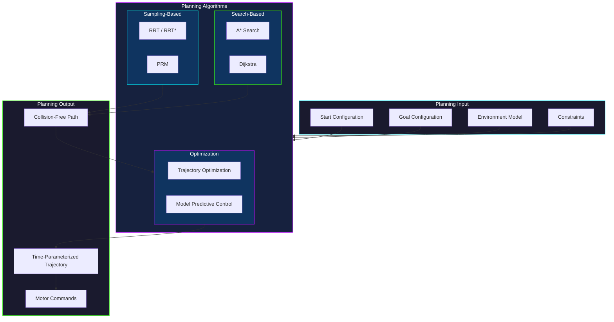
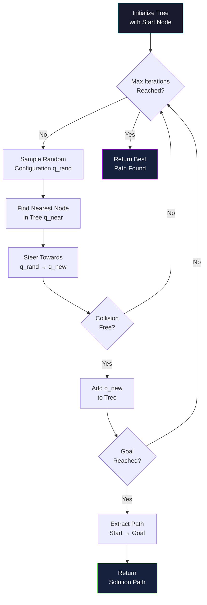

# Module 4: Robot Motion Planning and Control

## 1. Introduction to Motion Planning

Robot motion planning is a fundamental aspect of robotics, enabling autonomous systems to navigate and interact with their environment effectively. At its core, it involves determining a sequence of movements for a robot to transition from a starting configuration to a target configuration while adhering to various constraints.

### Problem Definition: What is robot motion planning and why is it important?

Robot motion planning is the computational problem of finding a valid path or trajectory for a robot in an environment containing obstacles. It's crucial because without effective planning, robots cannot perform complex tasks, navigate unknown spaces, or operate safely alongside humans. This field bridges the gap between high-level task commands and low-level motor control.

### Key Objectives: Reachability, optimality, safety.

The primary objectives of motion planning include:
*   **Reachability:** Ensuring that a path exists and can be found to the desired goal.
*   **Optimality:** Finding the "best" path based on criteria like shortest distance, minimum time, minimum energy, or smoothest motion.
*   **Safety:** Guaranteeing that the robot avoids collisions with obstacles, self-collisions, and operates within safe physical limits.

### Types of Planning:

Motion planning encompasses various sub-disciplities:

*   **Path Planning:** Focuses on finding a purely geometric path—a sequence of configurations—without considering the time it takes to traverse. It's about *where* the robot should go.
*   **Trajectory Planning:** Extends path planning by adding time parametrization, specifying not only the path but also the velocities, accelerations, and often jerks along that path. It's about *how* and *when* the robot should move.
*   **Task Planning vs. Motion Planning:** Task planning operates at a higher level of abstraction, dealing with logical sequences of actions (e.g., "pick up object A, then move to location B"). Motion planning takes these abstract tasks and translates them into concrete, executable robot movements.

### Motion Planning Pipeline

### RRT Algorithm Flow

## 2. Configuration Space (C-space)

Understanding the robot's environment is crucial for motion planning, and the concept of Configuration Space (C-space) is central to this.

### Definition of Configuration Space: Generalized coordinates, robot state representation.

The **Configuration Space (C-space)** is a mathematical construct that represents all possible configurations (positions and orientations) of a robot. Each point in C-space corresponds to a unique pose of the robot. For a robot with `n` degrees of freedom (DoF), its C-space is an `n`-dimensional space. For example, a point robot moving in a 2D plane has a 2D C-space (x, y), while a robot arm with three rotational joints has a 3D C-space (joint angle 1, joint angle 2, joint angle 3).

### C-space Obstacles: Mapping physical obstacles into C-space.

A key challenge is translating physical obstacles from the robot's **Workspace** (the 3D physical environment) into C-space. A **C-space Obstacle** (C-obstacle) is the set of all robot configurations where the robot would be in collision with a physical obstacle. The process of calculating C-obstacles can be computationally intensive, especially for complex robots and environments. The free C-space (C-free) is the set of all non-colliding configurations.

### C-space Dimensionality: Impact on planning complexity.

The dimensionality of the C-space directly impacts the complexity of motion planning. As the number of degrees of freedom increases, the C-space grows exponentially, leading to the "curse of dimensionality." This makes exhaustive search impractical and necessitates more sophisticated algorithms.

### Work Space vs. Configuration Space.

*   **Workspace:** The physical 3D environment where the robot operates and where physical obstacles exist. It's intuitive for humans to understand.
*   **Configuration Space:** An abstract space representing all possible robot poses. It simplifies collision detection to checking if a point (robot configuration) lies within a C-obstacle.

## 3. Path Planning Algorithms (Non-holonomic)

Path planning algorithms are designed to find a sequence of valid configurations for a robot to move from a start to a goal. Non-holonomic constraints, often found in wheeled robots, restrict the robot's instantaneous motion (e.g., a car cannot move sideways), adding complexity to planning.

### Sampling-based Algorithms:

These algorithms explore the C-space by generating random samples and connecting them to build a graph or tree. They are often used for high-dimensional C-spaces and complex environments.

*   **Rapidly-exploring Random Trees (RRT and RRT*):**
    *   **Principles:** RRT explores the C-space by incrementally building a tree from the start configuration towards the goal. It randomly samples a point in C-space, finds the nearest node in the tree, and extends the tree towards the sampled point. This rapid exploration makes it suitable for quickly finding a path in high-dimensional spaces.
    *   **Advantages:** Computationally efficient for high-dimensional spaces, probabilistically complete (guaranteed to find a path if one exists given enough time).
    *   **Limitations:** The initial RRT finds a path but not necessarily an optimal one.
    *   **RRT\***: An extension of RRT that aims for asymptotic optimality. It rewires the tree by checking for better parent nodes for new samples and for existing nodes in their vicinity, converging to an optimal path as the number of samples increases.

*   **Probabilistic Roadmaps (PRM):**
    *   **Graph Construction:** PRM constructs a roadmap (a graph) in the C-space. It first samples a set of random configurations (nodes) in the C-free space. Then, it attempts to connect nearby nodes with straight-line paths (edges), checking each path for collisions.
    *   **Query Phase:** Once the roadmap is built, path planning becomes a graph search problem. Given a start and goal configuration, they are connected to the nearest roadmap nodes, and a standard graph search algorithm (like Dijkstra's or A\*) is used to find a path through the roadmap.
    *   **Advantages:** Efficient for multiple queries in the same environment (roadmap is built once).
    *   **Limitations:** Requires a dense enough roadmap to be probabilistically complete.

### Search-based Algorithms:

These algorithms systematically explore the C-space, often represented as a grid or discrete graph, to find an optimal path.

*   **A\* Search Algorithm:**
    *   **Heuristics:** A\* is a best-first search algorithm that finds the shortest path between a start and a goal node in a graph. It uses a heuristic function to estimate the cost from the current node to the goal, guiding the search more efficiently than Dijkstra's.
    *   **Grid-based Planning:** Often applied to grid-based C-spaces where the environment is discretized into cells, and each cell represents a traversable or an obstacle region.
    *   **Advantages:** Finds optimal paths (if the heuristic is admissible), efficient for many applications.
    *   **Limitations:** Can be computationally expensive for large grids or high-dimensional spaces.

*   **Dijkstra's Algorithm:**
    *   **Shortest path in graphs:** Finds the shortest paths from a single source node to all other nodes in a graph with non-negative edge weights. It explores the graph layer by layer, always expanding the node with the smallest known distance from the source.
    *   **Advantages:** Guaranteed to find the optimal path in terms of cumulative cost.
    *   **Limitations:** Can be slow as it explores all possible paths, less efficient than A\* when a good heuristic is available.

*   **Extensions: D\* Lite, Field D\*:**
    *   These are extensions of D\* (Dynamic A\*) algorithm, which are designed for dynamic environments where obstacles may appear or disappear. They efficiently re-plan paths by only updating the affected parts of the graph, making them suitable for real-time navigation.

## 4. Trajectory Planning

Once a geometric path is found, trajectory planning is responsible for assigning time, velocity, and acceleration to that path, ensuring smooth and dynamically feasible motion.

### Time Parameterization: Converting paths into time-based trajectories.

Time parameterization involves transforming a purely geometric path `P(s)` (where `s` is a path parameter) into a time-dependent trajectory `Q(t)`. This means determining *when* the robot should be at each point along the path.

### Velocity and Acceleration Constraints: Kinematic limits, smooth motion.

Robots have physical limits on their joint velocities and accelerations. Trajectory planning must ensure that these kinematic limits are not violated, which is critical for safe and reliable operation. Additionally, trajectories should be smooth to minimize wear and tear, reduce vibrations, and enable precise control.

### Splines and Polynomials:

These mathematical tools are commonly used to generate smooth, continuous trajectories.

*   **Cubic Splines:** Piecewise cubic polynomials that are used to interpolate a set of waypoints. They ensure continuity of position and velocity (C1 continuity) and often acceleration (C2 continuity) at the waypoints, resulting in smoother motion than simple linear interpolation.
*   **Quintic Polynomials:** Higher-order polynomials (fifth-degree) that allow for control over position, velocity, and acceleration at both the start and end points of a segment. They provide very smooth transitions, often used in applications requiring precise control and minimal jerk.
*   **Bezier Curves:** Parametric curves defined by a set of control points. They are widely used in computer graphics and robotics for generating smooth, aesthetically pleasing paths that pass through or near specified points.

### Jerk Minimization.

**Jerk** is the rate of change of acceleration. Minimizing jerk leads to smoother, more comfortable motions for both the robot and any payloads it carries. Quintic polynomials are often employed for jerk minimization because they allow for direct control over acceleration at segment boundaries.

### Online vs. Offline Trajectory Generation.

*   **Offline Trajectory Generation:** Trajectories are computed entirely before the robot begins execution. This approach is suitable for well-known, static environments and repetitive tasks where computation time is not a critical constraint.
*   **Online Trajectory Generation:** Trajectories are generated or modified in real-time during robot execution. This is essential for dynamic environments, human-robot interaction, or when unforeseen events require immediate adaptation.

## 5. Motion Control Architectures

Motion control architectures define how a robot's movements are regulated and executed, ranging from simple open-loop systems to sophisticated feedback-based approaches.

### Open-loop Control: Execution without feedback, limitations.

In **open-loop control**, the robot executes a pre-programmed motion command without using sensor feedback to verify or correct its actual position or velocity.
*   **Execution without feedback:** The controller sends commands to the actuators, assuming they will perform as expected.
*   **Limitations:** Highly susceptible to disturbances, model inaccuracies, and changes in the environment. It lacks robustness and accuracy in real-world scenarios, making it suitable only for very precise, predictable systems or for initial rough movements.

### Closed-loop Control (Feedback Control): Using sensor data for correction.

**Closed-loop control**, or **feedback control**, continuously monitors the robot's actual state using sensors and compares it to the desired state. Any discrepancy (error) is used to adjust the control commands, thereby correcting the robot's motion.
*   **Using sensor data for correction:** Sensors provide real-time information about the robot's position, velocity, forces, etc., which is fed back to the controller.

### Components of a Feedback Loop: Controller, plant, sensors, feedback.

A typical feedback control loop consists of:
*   **Controller:** The computational unit that calculates the required control output based on the error and the control law (e.g., PID).
*   **Plant:** The system being controlled, in this case, the robot and its actuators.
*   **Sensors:** Devices that measure the actual state of the plant (e.g., encoders for joint angles, IMUs for orientation, force/torque sensors).
*   **Feedback:** The signal from the sensors that is fed back to the controller to compare with the desired input.

### Control Hierarchy: High-level planning, low-level execution.

Robotic systems often employ a hierarchical control architecture:
*   **High-level planning:** Deals with task planning, global path planning, and strategic decision-making. It generates abstract goals or desired trajectories.
*   **Low-level execution:** Focuses on precise execution of joint movements, torque control, and ensuring stability and compliance. It takes the high-level commands and translates them into motor commands.

## 6. Joint Space Control

Joint space control involves directly controlling the individual joints of a robot, which is often simpler to implement for manipulators.

### PID Control (Proportional-Integral-Derivative):

PID control is a widely used feedback control loop mechanism.

*   **Fundamentals of PID:** A PID controller calculates an error value as the difference between a desired setpoint and a measured process variable. It attempts to minimize the error by adjusting the process control inputs.
    *   **Proportional (P) term:** Proportional to the current error. A larger P-term means a stronger response to errors.
    *   **Integral (I) term:** Accounts for past errors, eliminating steady-state errors by accumulating them over time.
    *   **Derivative (D) term:** Predicts future errors by considering the rate of change of the current error, providing damping and reducing overshoot.
*   **Tuning methods (Ziegler-Nichols):** Various methods exist to find optimal PID gains (Kp, Ki, Kd), such as trial-and-error, Ziegler-Nichols method, or more advanced optimization techniques.
*   **Applications in robotic joints:** PID controllers are commonly used to control the position, velocity, or torque of individual robotic joints. Each joint might have its own PID controller, working independently or coordinated with others.

### Gravity Compensation: Counteracting gravitational forces.

For multi-joint robotic manipulators, gravity exerts significant forces that can affect control accuracy. **Gravity compensation** involves calculating the torques required to counteract these gravitational forces at each joint and adding them to the control output. This effectively makes the robot appear "weightless" to the controller, simplifying subsequent control tasks.

### Impedance Control: Regulating the robot's dynamic interaction with the environment.

**Impedance control** is a control strategy that aims to regulate the relationship between the robot's motion and the contact forces it experiences with the environment. Instead of directly controlling position or force, it controls the *mechanical impedance* (a generalized concept of stiffness and damping) of the robot as perceived by the environment. This is crucial for tasks like polishing, grinding, or assembly where flexible interaction is needed.

### Admittance Control: Complementary approach to impedance control.

**Admittance control** is the dual of impedance control. While impedance control regulates motion in response to contact forces, admittance control regulates forces in response to deviations from a desired motion. It makes the robot "admit" or yield to external forces according to a desired admittance model (mass, spring, damper).

## 7. Task Space Control (Operational Space Control)

Task space control, also known as operational space control, focuses on controlling the robot's end-effector directly in Cartesian (x, y, z, roll, pitch, yaw) coordinates, which is often more intuitive for human operators and task specification.

### Inverse Kinematics: Mapping desired end-effector poses to joint configurations.

**Inverse Kinematics (IK)** is the mathematical problem of determining the joint angles (or other generalized coordinates) of a robot that will achieve a desired pose (position and orientation) for its end-effector. This is often a non-linear problem with multiple solutions, no solutions, or singular configurations.

### Inverse Dynamics Control: Controlling forces/torques at the end-effector.

**Inverse dynamics control** involves calculating the joint torques (or forces) required to achieve a desired end-effector acceleration or force in task space. It uses the robot's dynamic model (mass, inertia, Coriolis, centrifugal forces) to compute these torques, effectively decoupling the robot's dynamics and allowing for more precise control.

### Operational Space Control: Directly controlling the end-effector in Cartesian space.

**Operational space control** allows for direct control of the robot's end-effector in Cartesian space while simultaneously managing joint-space objectives (e.g., avoiding joint limits or singularities). It achieves this by projecting joint torques into the operational space, enabling the robot to respond to commands specified in terms of end-effector movements.

### Force Control: Regulating interaction forces.

**Force control** specifically focuses on regulating the forces exerted by the robot on its environment. This is critical for tasks like peg-in-hole insertion, surface following, or any task requiring controlled physical interaction. It often involves using force/torque sensors at the robot's wrist.

### Hybrid Position/Force Control.

**Hybrid position/force control** combines aspects of both position and force control. In certain directions, the robot is controlled in position (e.g., moving freely in the air), while in other directions, it is controlled in force (e.g., maintaining a specific contact force against a surface). This is particularly useful for tasks involving contact where both position and force must be precisely regulated.

## 8. Collision Avoidance

Collision avoidance is paramount for safe and reliable robot operation, protecting both the robot and its environment, including humans.

### Static Obstacle Avoidance: Planning paths around stationary objects.

**Static obstacle avoidance** deals with preventing collisions with stationary obstacles in the environment. This is typically handled during the path planning phase by identifying C-obstacles and ensuring that the planned path stays within the C-free space.

### Dynamic Obstacle Avoidance: Real-time adaptation to moving obstacles.

**Dynamic obstacle avoidance** is more complex as it involves reacting to and predicting the motion of moving obstacles (e.g., other robots, humans, or changing environmental elements) in real-time. This requires continuous sensing and re-planning or reactive control strategies.

### Reactive Control: Sensor-based immediate responses.

**Reactive control** provides immediate, sensor-based responses to unforeseen obstacles or events. These are often simple, rule-based behaviors that prioritize safety and quick reactions over optimal paths. Examples include stopping if an object is too close or deviating slightly from a path to avoid a moving object.

### Potential Fields: Generating repulsive forces from obstacles.

**Potential field methods** represent the robot's environment as a landscape of forces. The goal creates an attractive force, while obstacles create repulsive forces. The robot then moves as if it's being pushed and pulled by these forces, navigating towards the goal while avoiding obstacles.
*   **Advantages:** Simple to implement, computationally efficient for local obstacle avoidance.
*   **Limitations:** Can suffer from local minima (where the robot gets stuck before reaching the goal) and oscillations.

### Reciprocal Velocity Obstacles (RVO): Multi-robot collision avoidance.

**Reciprocal Velocity Obstacles (RVO)** is a technique specifically designed for multi-robot collision avoidance. It calculates the set of velocities that would lead to a collision with another robot and then chooses a new velocity that avoids this "velocity obstacle" while minimizing deviation from the desired path. The "reciprocal" aspect ensures that both robots consider each other's avoidance maneuvers for smoother, cooperative collision avoidance.

### Safety Zones and Minimum Distance Constraints.

Implementing **safety zones** around robots and obstacles, along with **minimum distance constraints**, is a common practice to enhance safety. The robot's planning and control systems are designed to maintain a minimum safe distance from all detected objects, effectively creating a buffer that prevents actual physical contact.

## 9. Human-Robot Collaboration (Motion aspects)

Human-Robot Collaboration (HRC) focuses on designing robots that can work effectively and safely alongside humans, sharing the same workspace and tasks.

### Shared Control: Human and robot jointly control motion.

**Shared control** involves both a human operator and an autonomous robot system contributing to the control of the robot's motion. The human might provide high-level guidance or set goals, while the robot handles low-level execution and compliance, or vice-versa. This leverages the strengths of both human intuition and robotic precision.

### Compliant Motion: Robot yields to human forces.

**Compliant motion** refers to a robot's ability to yield to external forces or adapt its motion in response to physical contact. In HRC, this is essential for safety and intuitive interaction. If a human pushes the robot, a compliant robot will "give way" rather than resisting rigidly, preventing injury and allowing for collaborative manipulation.

### Leader-Follower Architectures.

In **leader-follower architectures**, one entity (either human or robot) acts as the leader, dictating the overall motion or task, while the other acts as the follower, adapting its actions to assist the leader. For example, a human might guide a robot arm (leader), and the robot follows with a tool (follower) to perform a task.

### Safety in HRC: Physical human-robot interaction (pHRI).

Safety is the paramount concern in HRC. **Physical Human-Robot Interaction (pHRI)** focuses on designing robots and control strategies that minimize the risk of injury to humans during direct physical contact. This involves techniques like force limiting, speed reduction when humans are near, soft robotics, and advanced collision detection and response mechanisms.

### Intent Recognition for Motion Adaptation.

For seamless HRC, robots need to understand human intentions. **Intent recognition** involves using sensors (e.g., cameras, motion trackers, force sensors) and AI algorithms to infer the human operator's goals, desired movements, or even emotional state. The robot can then proactively adapt its motion to better assist the human, leading to more fluid and natural collaboration.

## 10. Challenges in Motion Planning and Control

Despite significant advancements, motion planning and control for robots in complex, dynamic, and uncertain environments still present numerous challenges.

### Real-time Constraints: Fast computation for dynamic environments.

Many real-world robotic applications, especially those involving interaction with humans or moving objects, require rapid decision-making. **Real-time constraints** demand that planning and control algorithms execute within very short timeframes, often milliseconds, to enable fluid and responsive behavior. The computational cost of complex algorithms can be a significant bottleneck.

### Uncertainty: Sensor noise, model inaccuracies, environmental variations.

Robotic systems always operate under **uncertainty**.
*   **Sensor noise:** Imperfections in sensor readings introduce inaccuracies in the robot's perception of its own state and the environment.
*   **Model inaccuracies:** The mathematical models used to represent the robot's kinematics, dynamics, or the environment are never perfectly accurate.
*   **Environmental variations:** Real-world environments are inherently unpredictable, with unknown objects, changing lighting conditions, and dynamic elements. Robust planning and control must account for these uncertainties.

### High Degrees of Freedom (DOF): Increased computational complexity.

Manipulators and humanoid robots often possess a **high number of degrees of freedom (DOF)**. While this allows for greater dexterity, it exponentially increases the dimensionality of the C-space, leading to the "curse of dimensionality" and making motion planning computationally intractable for many traditional algorithms.

### Computational Cost of Algorithms.

Many advanced motion planning algorithms, especially those that aim for optimality or completeness, can be **computationally very expensive**. This limits their applicability in real-time scenarios or on resource-constrained robot hardware. Trade-offs between optimality, completeness, and computational speed are often necessary.

### Sensor Limitations and Noise.

The accuracy and reliability of **sensors** directly impact the quality of motion planning and control. Limitations such as finite range, limited field of view, poor performance in certain lighting conditions, and inherent noise can lead to incomplete or inaccurate environmental maps and state estimates, making robust decision-making challenging.

### Environmental Clutter and Deformable Objects.

Navigating highly **cluttered environments** is difficult because it increases the number of potential collisions and reduces the free C-space. Furthermore, interacting with **deformable objects** (e.g., fabrics, flexible cables) poses a significant challenge, as their shape and properties change dynamically upon contact, making accurate modeling and prediction of their behavior complex.

## 11. Future Trends

The field of robot motion planning and control is continuously evolving, with exciting new trends driven by advancements in artificial intelligence, machine learning, and human-robot interaction.

### Learning-based Planning: Reinforcement learning, deep learning for motion generation.

The integration of **learning-based approaches** is revolutionizing motion planning.
*   **Reinforcement Learning (RL):** Robots can learn optimal policies for motion planning through trial and error, by interacting with simulated or real environments and receiving rewards for desired behaviors (e.g., reaching a goal, avoiding collisions). RL excels at adapting to complex, high-dimensional spaces.
*   **Deep Learning for Motion Generation:** Deep neural networks are being used to generate complex and natural-looking motions from high-level commands, learn motion primitives, or predict human movements, leading to more fluid and intelligent robot behavior.

### AI-driven Control: Adaptive and intelligent control systems.

Traditional control systems often rely on precise mathematical models. **AI-driven control** aims to create more adaptive and intelligent control systems that can learn from data, adapt to changing dynamics, and handle uncertainties more effectively. This includes neural network-based controllers, fuzzy logic control, and adaptive control techniques that leverage AI for parameter tuning and robust performance.

### Human-in-the-Loop Planning and Control.

Recognizing the strengths of both humans and AI, **human-in-the-loop (HIL) planning and control** approaches involve integrating human intelligence and intuition into the robotic decision-making process. This could involve humans providing guidance, correcting errors, or validating robot plans, especially in complex or safety-critical situations. This allows for more robust and trustworthy autonomous systems.

### Generative Models for Motion.

Inspired by successes in other AI domains, **generative models** (e.g., Generative Adversarial Networks, Variational Autoencoders) are being explored to synthesize novel and diverse robot motions. These models can learn from large datasets of human or robot movements and generate new, unseen trajectories that are natural, fluent, and task-appropriate, opening new avenues for personalized and adaptive robot behaviors.

### Explainable AI in Robotics.

As robots become more autonomous and intelligent, there is a growing need for **Explainable AI (XAI) in robotics**. This involves developing methods that allow robots to explain their decisions and actions, particularly in motion planning and control. Understanding *why* a robot chose a particular path or performed a certain action is crucial for debugging, ensuring safety, and building trust in collaborative environments.

### Safe AI for Autonomous Systems.

The overarching goal for future robotics is to ensure **Safe AI for Autonomous Systems**. This encompasses developing rigorous methods for verification and validation of AI-powered planning and control systems, robust anomaly detection, fail-safe mechanisms, and ethical considerations. The focus is on building robots that are not only intelligent and capable but also inherently safe, reliable, and trustworthy in all operational contexts.
