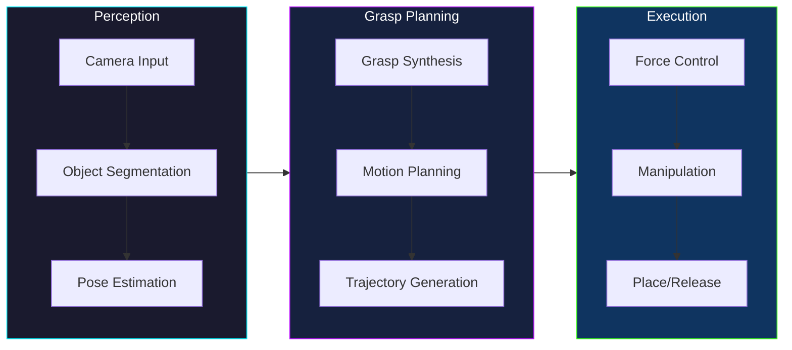
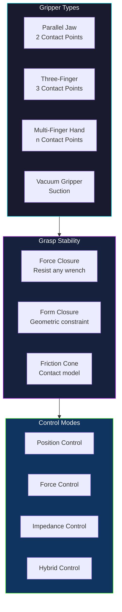

# Module 7: Humanoid Robot Manipulation and Interaction

## 1. Introduction to Robot Manipulation

Robot manipulation is a cornerstone of modern robotics, enabling automated systems to interact physically with their environment. From industrial assembly lines to assistive robots in homes, the ability of robots to grasp, move, and reconfigure objects is critical for a vast array of applications.

### Importance of Robot Manipulation in Various Applications
The significance of robot manipulation extends across numerous domains:
*   **Manufacturing and Assembly:** Robots perform precise tasks like picking components, assembling products, and quality control.
*   **Logistics and Warehousing:** Automated systems handle sorting, packing, and moving goods, optimizing supply chains.
*   **Healthcare:** Surgical robots assist in delicate procedures, while assistive robots help patients with daily tasks.
*   **Exploration:** Robots manipulate tools in hazardous environments, such as space or deep-sea exploration.
*   **Service Robotics:** Humanoid robots could one day assist in domestic tasks, elder care, or retail, requiring sophisticated manipulation skills.

### Types of Manipulation
Manipulation encompasses a broad spectrum of interactions:
*   **Grasping:** The act of securely holding an object, a fundamental skill for almost all manipulation tasks.
*   **Pushing:** Applying force to an object to move it across a surface, useful when grasping is difficult or unnecessary.
*   **Pulling:** Similar to pushing, but involving drawing an object towards the robot.
*   **Throwing:** Projecting an object with a specific trajectory, often for placing objects in distant or inaccessible locations.
*   **Deformation:** Manipulating deformable objects like cloth or pliable materials.
*   **Tool Use:** Operating external tools (e.g., screwdrivers, wrenches) to perform tasks.

### Key Challenges in Robot Manipulation
Despite significant advancements, robot manipulation faces several inherent challenges:
*   **Perception:** Accurately identifying objects, their properties (shape, weight, texture), and their poses in complex, dynamic environments.
*   **Uncertainty:** Dealing with variations in object properties, sensor noise, and environmental unpredictability.
*   **Dexterity:** Achieving human-like agility and precision with robot end-effectors, especially for complex or delicate tasks.
*   **Contact Modeling:** Accurately predicting and controlling forces and friction at contact points during interaction.
*   **Real-time Computation:** Performing complex planning and control computations quickly enough to react to dynamic changes.
*   **Generalization:** Developing manipulation skills that can generalize to novel objects and tasks without extensive re-programming.

### Manipulation Pipeline

### Grasp Types and Contact Models

## 2. Grasping

Grasping is the foundational skill for robot manipulation, defining how a robot establishes stable contact with an object. A successful grasp ensures the object can be held securely and manipulated as intended.

### 2.1. Gripper Design
The choice and design of a gripper are crucial for effective grasping. Grippers are the "hands" of a robot, tailored to specific tasks and object characteristics.

*   **Types of Grippers:**
    *   **Parallel Jaw Grippers:** The most common type, featuring two opposing "jaws" that close to grip an object. They are simple, robust, and effective for a wide range of objects.
    *   **Three-Finger Grippers:** Offer more versatility than parallel jaws, providing better stability for irregularly shaped objects and enabling internal as well as external grasps.
    *   **Multi-finger Grippers (Anthropomorphic Hands):** Designed to mimic the human hand with multiple articulated fingers. They offer high dexterity and adaptability but are mechanically complex and challenging to control.
    *   **Vacuum Grippers:** Utilize suction cups to lift objects, particularly effective for flat, smooth, and non-porous surfaces. They are common in packaging and material handling.
    *   **Adhesive Grippers:** Employ adhesives (e.g., gecko-inspired materials, compliant skins) to grip objects without requiring significant clamping force.
    *   **Underactuated Grippers:** Have fewer actuators than degrees of freedom, allowing the gripper to conform passively to object shapes, simplifying control.

*   **Design Considerations:**
    *   **Payload:** The maximum weight the gripper can safely lift.
    *   **Object Properties:** Shape, size, weight, material (friction, deformability), fragility.
    *   **Environment:** Workspace constraints, presence of contaminants (dust, liquids), temperature.
    *   **Task Requirements:** Required precision, speed, robustness, and specific manipulation actions.
    *   **Cost and Complexity:** Balancing performance with manufacturing and maintenance costs.

### 2.2. Grasp Planning
Grasp planning is the process of determining where and how a gripper should interact with an object to achieve a stable grasp.

*   **Approaches to Grasp Planning:**
    *   **Analytical Methods:** Based on geometric models of the object and gripper, using mathematical formulations to find stable contact points. These often rely on force and form closure principles.
    *   **Data-Driven Methods:** Utilize large datasets of successful grasps on various objects. Algorithms learn patterns and generalize to new objects.
    *   **Learning-Based Methods (e.g., Deep Learning):** Train neural networks to predict optimal grasp poses directly from sensory data (e.g., camera images, depth maps), often end-to-end. This approach can handle novel objects and complex scenes.
    *   **Heuristic-Based Methods:** Employ rules of thumb or simplified models to quickly generate candidate grasps, often used as a preliminary step for more rigorous analysis.

*   **Grasp Quality Metrics:**
    *   **Force Closure:** A measure of how well a grasp can resist external forces and torques from any direction (discussed in 2.3).
    *   **Form Closure:** A measure of how well a grasp can constrain an object purely by contact geometry, without relying on friction (discussed in 2.4).
    *   **Robustness:** The grasp's ability to tolerate small errors in object pose or gripper placement.
    *   **Grasp Wrench Space (GWS):** A geometric representation of the forces and torques that a gripper can apply to an object.
    *   **Energy-based Metrics:** Quantify the amount of energy required to dislodge an object from a grasp.

### 2.3. Force Closure
Force closure is a critical concept in grasping, indicating a grasp's ability to resist external disturbances.

*   **Definition and Significance:** A grasp is in **force closure** if the contact forces and friction at the gripper-object interface can counteract any arbitrary external wrench (force and torque) applied to the object, preventing it from moving. It signifies a robust and stable grasp, even with friction.

*   **Conditions for Force Closure:**
    *   The contact points and normal forces must be carefully chosen.
    *   The friction cones at each contact point must "trap" the object, meaning that all possible directions of motion are resisted by the friction and normal forces.
    *   Mathematically, it implies that the origin of the wrench space is contained within the convex hull of the basis wrenches generated by the contact points and friction cones.

### 2.4. Form Closure
Form closure is a more stringent condition than force closure, focusing purely on geometric constraint.

*   **Definition and Significance:** A grasp is in **form closure** if the object is completely constrained by the contact points, irrespective of friction. This means the object cannot move at all, regardless of any external forces, solely due to the geometry of the contact. Form closure implies force closure.

*   **Conditions for Form Closure:**
    *   Requires a minimum number of contact points (e.g., 7 points for a 3D object, often fewer if contact surfaces are used).
    *   The contact normals must point in directions that fully constrain all degrees of freedom of the object.
    *   Often involves "wrapping" the object to prevent any translational or rotational motion. Achieved by ensuring that the linear span of the wrench basis vectors contains the entire wrench space.

## 3. Manipulation Planning

Manipulation planning deals with the sequential actions and movements a robot performs to achieve a desired manipulation task, such as moving an object from one location to another.

### 3.1. Motion Planning for Manipulators
Motion planning focuses on finding a collision-free path for a robot's end-effector and body through a given environment.

*   **Configuration Space and Obstacles:**
    *   **Configuration Space (C-space):** A mathematical space that represents all possible configurations (positions and orientations) of a robot. Each point in C-space corresponds to a unique pose of the robot.
    *   **C-obstacle:** The region in C-space that corresponds to configurations where the robot collides with an obstacle in the physical workspace. Motion planning aims to find a path in the "free C-space" (C-free).

*   **Path Planning Algorithms:**
    *   **Sampling-Based Algorithms:**
        *   **Rapidly-exploring Random Trees (RRT/RRT*):** Build a tree of valid robot configurations by randomly sampling points in C-space and connecting them to the nearest existing tree node. RRT* guarantees asymptotic optimality.
        *   **Probabilistic Roadmaps (PRM):** Construct a roadmap (graph) by sampling many random configurations, connecting nearby valid samples, and then searching this graph for a path. Effective for complex, high-dimensional spaces.
    *   **Search-Based Algorithms:**
        *   **A* (A-star) Algorithm:** A graph traversal and pathfinding algorithm that finds the shortest path between two nodes. It uses a heuristic function to guide the search, making it more efficient than Dijkstra's algorithm. Often used on discretized C-spaces.
    *   **Other Algorithms:**
        *   **Potential Fields:** Treat the robot's goal as an attractive force and obstacles as repulsive forces, guiding the robot along a path. Can suffer from local minima.
        *   **Trajectory Optimization:** Instead of finding a path, these methods optimize a full trajectory by minimizing cost functions (e.g., energy, time, jerk) while satisfying constraints (e.g., collision avoidance, joint limits).

*   **Trajectory Generation:**
    *   Once a path is found in C-space, trajectory generation adds time information, specifying the robot's joint positions, velocities, and accelerations over time.
    *   Common techniques include polynomial interpolation (e.g., cubic, quintic splines) to ensure smooth motion and satisfy joint velocity/acceleration limits.
    *   Goal is to produce smooth, dynamically feasible, and time-optimal movements.

### 3.2. Inverse Kinematics for Reaching
Inverse kinematics (IK) is a fundamental problem in robotics for controlling manipulator poses.

*   **Definition and Importance:** **Inverse kinematics** is the process of calculating the joint angles of a robot manipulator required to achieve a desired position and orientation (pose) of its end-effector. It is crucial for tasks where a robot needs to reach specific target locations in space.

*   **Analytical and Numerical Solutions:**
    *   **Analytical Solutions:** Involve closed-form mathematical equations that directly compute joint angles. These are fast and precise but only exist for specific robot geometries (e.g., PUMA-like robots with spherical wrists).
    *   **Numerical Solutions:** Use iterative optimization techniques to find joint angles that minimize the error between the current end-effector pose and the desired pose. These are more general, applicable to any robot, but can be computationally intensive, may not always converge, and can get stuck in local minima. Common methods include Jacobian-based pseudoinverse techniques.

*   **Redundancy and Singularity Handling:**
    *   **Redundancy:** Robots with more degrees of freedom (DoF) than required for a task (e.g., a 7-DoF arm reaching a 6-DoF pose) are redundant. This allows for choosing from multiple IK solutions, which can be exploited to optimize other criteria (e.g., avoid joint limits, obstacles, or singularities).
    *   **Singularity Handling:** A **singularity** is a robot configuration where the manipulator loses one or more degrees of freedom, meaning it cannot move its end-effector in certain directions. At singularities, the Jacobian matrix becomes singular, causing numerical IK solutions to fail or become unstable. Strategies include avoiding singular regions, using damped least squares, or exploiting redundancy.

## 4. Compliant Manipulation

Compliant manipulation involves controlling the interaction forces between a robot and its environment, allowing for flexible and adaptive behavior, especially when dealing with uncertainty or deformable objects.

### 4.1. Impedance Control
Impedance control allows a robot to behave like a mass-spring-damper system, defining its dynamic relationship between force and motion.

*   **Concept and Applications:** **Impedance control** specifies the desired dynamic relationship (impedance) between the robot's end-effector motion and the forces it experiences. Instead of directly controlling force or position, it controls the "resistance" the robot offers to external forces.
    *   **Applications:** Human-robot collaboration (e.g., carrying an object together), grinding, polishing, assembly tasks where parts might not fit perfectly, and physical rehabilitation.

*   **Implementation Details:** The controller calculates the desired force based on the deviation from a virtual trajectory and the specified impedance (virtual stiffness, damping, and inertia). This desired force is then achieved through a low-level torque or position controller. It essentially makes the robot "yield" or "push back" with a controlled amount of compliance.

### 4.2. Admittance Control
Admittance control is a complementary approach to impedance control, defining the desired motion in response to applied forces.

*   **Concept and Applications:** **Admittance control** specifies the desired motion (admittance) of the robot's end-effector in response to contact forces. The robot measures external forces and then adjusts its position/velocity accordingly, behaving like a virtual mass-spring-damper system, but with force as input and motion as output.
    *   **Applications:** Similar to impedance control, but often preferred for tasks where external forces are measured (e.g., with a force-torque sensor) and the robot needs to react by moving compliantly. Examples include human-guided manipulation or contact-rich tasks where the environment dictates motion.

*   **Comparison with Impedance Control:**
    *   **Impedance Control:** Controls how the robot "feels" (force output for position input). The robot tries to maintain a position but gives way according to its virtual impedance.
    *   **Admittance Control:** Controls how the robot "moves" (position/velocity output for force input). The robot senses force and moves accordingly.
    *   Both achieve compliant behavior, but their control loops and stability characteristics can differ, especially in contact. Admittance control is typically implemented as an outer loop adjusting position commands, while impedance control directly influences joint torques or inner position loops.

### 4.3. Force Control
Force control directly regulates the forces exerted by the robot on its environment.

*   **Basic Principles of Force Control:** In pure force control, the robot tries to maintain a specific contact force, adjusting its position to achieve this. This requires accurate force sensing (e.g., using force-torque sensors at the wrist or tactile sensors on the gripper).

*   **Hybrid Force/Position Control:** This common strategy combines force and position control. In certain directions (e.g., normal to a surface), the robot controls force, while in other directions (e.g., along the surface), it controls position.
    *   **Applications:** Deburring, contour following, writing, or inserting pegs into holes, where precise force along one axis and precise position along others are required.
    *   The task frame is divided into force-controlled and position-controlled directions, allowing the robot to interact compliantly in some degrees of freedom while maintaining stiffness in others.

## 5. Introduction to Human-Robot Interaction (HRI)

Human-Robot Interaction (HRI) is a multidisciplinary field dedicated to understanding, designing, and evaluating robotic systems for use by or with humans. In the context of humanoid robotics, HRI is paramount, as these robots are designed to operate in human-centric environments.

### Goals of HRI
The overarching goals of HRI are to enable effective, efficient, and natural collaboration between humans and robots.
*   **Collaboration:** Allowing humans and robots to work together on shared tasks, leveraging the strengths of both.
*   **Assistance:** Robots providing help to humans, ranging from physical aid to cognitive support.
*   **Companionship:** Developing robots that can engage socially with humans, offering emotional support or entertainment.
*   **Learning and Teaching:** Robots learning from human demonstrations and humans teaching robots new skills.

### Challenges in HRI
Achieving seamless HRI is complex due to the inherent differences between human and robot capabilities and communication styles.
*   **Safety:** Ensuring that robots can operate safely in close proximity to humans, preventing injuries.
*   **Communication:** Bridging the gap between human natural language, gestures, and intentions, and a robot's computational understanding.
*   **Trust:** Building and maintaining human trust in robot reliability, competence, and benevolence.
*   **Social Norms:** Designing robots that can understand and adhere to human social conventions and etiquette.
*   **Usability:** Creating intuitive interfaces and interaction paradigms that are easy for humans to understand and operate.
*   **Adaptability:** Robots adapting to individual human users, their preferences, and dynamic interaction contexts.

### Importance of HRI in Humanoid Robotics
For humanoid robots, HRI is not just a feature but a core requirement. These robots are physically embodied to resemble humans, making human-like interaction essential for their acceptance and utility.
*   **Natural Interaction:** Humanoid form naturally primes humans to expect human-like communication and social cues.
*   **Shared Environments:** Humanoids are often envisioned for homes, hospitals, and public spaces, necessitating safe and socially intelligent interaction.
*   **Task Performance:** For tasks like assistance or collaboration, understanding human intent and providing clear feedback is crucial.
*   **Acceptance and Engagement:** Effective HRI fosters user acceptance, comfort, and willingness to engage with the robot.

## 6. Physical HRI

Physical HRI focuses on direct, tangible contact and close proximity interaction between humans and robots, requiring careful consideration of safety, control, and human comfort.

### 6.1. Shared Control
Shared control systems involve both human and robot contributing to the control of a task.

*   **Definition and Types of Shared Control:** Shared control is a control paradigm where human input and autonomous robot control are combined to execute a task.
    *   **Traded Control:** The human and robot take turns controlling the system.
    *   **Blended Control:** Human and robot control inputs are simultaneously combined, often with varying weighting, to produce the final robot action. The robot typically handles low-level details while the human provides high-level guidance.

*   **Human-in-the-Loop Control:** A specific form of shared control where human operators continuously monitor and intervene in robot operations, providing oversight and course correction as needed. This is common in teleoperation and supervisory control scenarios.

### 6.2. Physical Guidance
Physical guidance refers to methods where a human physically moves or manipulates a robot (or its end-effector) to teach it a task or guide its motion.

*   **Lead-through Programming (Programming by Demonstration):** The human physically guides the robot's arm through a desired trajectory, and the robot records the path and associated forces. This is an intuitive way to teach complex movements without explicit programming.
*   **Compliant Motion for Physical Interaction:** When a robot is designed with compliant behavior (e.g., using impedance or admittance control), it can be easily pushed and pulled by a human. This allows for fluid co-manipulation, where the robot "gives way" or "assists" based on the human's input, making physical collaboration safe and intuitive.

### 6.3. Human-Aware Motion Planning
Human-aware motion planning involves generating robot movements that consider the presence, safety, and comfort of nearby humans.

*   **Collision Avoidance with Humans:** Beyond avoiding static obstacles, robots must predict human movement and react dynamically to prevent collisions. This often involves real-time sensing (e.g., cameras, lidar) and predictive models of human motion.
*   **Proxemics and Comfort Zones:** Robots should respect human personal space. Proxemics is the study of human spatial needs and behaviors. Humanoid robots need to understand and maintain appropriate distances, avoiding invading intimate or personal zones unless invited.
*   **Intent Prediction:** Anticipating a human's future actions (e.g., where they will move, what object they intend to grasp) allows the robot to plan its movements proactively, leading to smoother and more efficient collaboration. This often involves machine learning models trained on human motion data.

## 7. Cognitive HRI

Cognitive HRI focuses on enabling robots to understand, reason about, and generate human-like communication, encompassing speech, language, and gestures.

### 7.1. Speech Recognition
Speech recognition is the ability of a robot to convert spoken language into text, forming the basis for verbal interaction.

*   **Techniques and Challenges in Robot Speech Recognition:**
    *   **Techniques:** Involves acoustic modeling, phonetic recognition, and language modeling, often leveraging deep learning architectures (e.g., recurrent neural networks, transformers).
    *   **Challenges:**
        *   **Noise:** Background noise in real-world environments degrades performance.
        *   **Variability:** Different accents, speaking styles, intonations, and vocabulary.
        *   **Continuous Speech:** Segmenting and understanding unbroken streams of speech.
        *   **Speaker Independence:** Robustly recognizing speech from any user without prior training.
        *   **Resource Constraints:** Limited computational power on some robotic platforms.

*   **Dialogue Systems:** Once speech is recognized, dialogue systems enable robots to engage in meaningful conversations. These systems manage the flow of interaction, track dialogue state, and generate appropriate robot responses. They often involve natural language understanding (NLU) and natural language generation (NLG) components.

### 7.2. Natural Language Understanding (NLU)
NLU allows robots to interpret the meaning, intent, and context of human language.

*   **Interpreting Human Commands and Intentions:** Robots need to go beyond just transcribing words to understanding what a human *means* by a command (e.g., "pick up the red block" vs. "pass me that"). This involves identifying key entities, actions, and constraints.
*   **Semantic Parsing:** The process of converting natural language sentences into structured, machine-readable representations (e.g., logical forms, executable commands) that the robot can act upon. This allows the robot to extract the semantic meaning of an utterance and map it to its internal capabilities.

### 7.3. Gesture Recognition
Gesture recognition enables robots to perceive and interpret non-verbal cues from humans.

*   **Detecting and Interpreting Human Gestures:** Using vision sensors (cameras, depth sensors), robots can track human body parts (hands, head, gaze) and classify dynamic movements or static poses as meaningful gestures (e.g., pointing, waving, thumbs up).
*   **Integration with Speech and Language:** For natural HRI, gestures are rarely used in isolation. Combining gesture recognition with speech recognition and natural language understanding provides a richer and more robust understanding of human intent, resolving ambiguities and enhancing the fluidity of interaction. For example, a robot might interpret "pick up *that*" with a pointing gesture more accurately.

## 8. Social HRI

Social HRI explores the social dimensions of human-robot interaction, focusing on how robots can engage with humans in socially intelligent and acceptable ways, particularly important for humanoid robots.

### 8.1. Non-Verbal Communication
Robots, especially humanoids, can use and interpret non-verbal cues to enhance interaction.

*   **Facial Expressions, Gaze, Body Posture:**
    *   **Facial Expressions:** Humanoid robots can display simplified facial expressions (e.g., happy, sad, confused) to convey internal states or responses to human actions.
    *   **Gaze:** Maintaining eye contact, shifting gaze to an object of interest, or following a human's gaze can significantly improve communication and indicate attention.
    *   **Body Posture:** The robot's overall stance and orientation can convey engagement, readiness, or avoidance.

*   **Robot Emotional Expression:** While robots don't experience emotions, they can be programmed to *express* them in ways that are understandable and appropriate for humans, fostering empathy and improving the user experience. This involves synthesizing expressive speech, facial animations, and body language.

### 8.2. Proxemics
Proxemics is crucial for robots to navigate and interact in socially acceptable ways.

*   **Understanding and Maintaining Appropriate Personal Space:** Humans have different "zones" of personal space (intimate, personal, social, public). Robots need to be programmed to recognize these zones and adjust their distance from humans accordingly, based on the context of the interaction and the relationship with the user. Violating personal space can cause discomfort or alarm.
*   **Cultural Considerations:** Personal space norms vary significantly across cultures. A robot operating in different regions must be able to adapt its proxemic behavior to local customs to ensure social acceptance and avoid misunderstandings.

### 8.3. Human-Robot Trust
Trust is a cornerstone of effective human-robot teams and long-term acceptance.

*   **Building and Maintaining Trust in Collaborative Tasks:** For humans to rely on robots in critical or shared tasks, they need to trust the robot's capabilities, intentions, and reliability. This is built over time through consistent, predictable, and transparent behavior.
*   **Factors Influencing Trust:**
    *   **Reliability:** The robot consistently performing its tasks correctly and without failure.
    *   **Transparency:** The robot's ability to explain its actions, intentions, and internal states (e.g., "I am picking up this object because you asked me to"). This is especially important when errors occur.
    *   **Predictability:** The robot behaving in a consistent and understandable manner, allowing humans to anticipate its actions.
    *   **Competence:** The perceived skill and ability of the robot to successfully complete its assigned tasks.
    *   **Benevolence:** The perception that the robot acts in the human's best interest.

## 9. User Interfaces for HRI

User interfaces for HRI are the means by which humans interact with and control robots, aiming for intuitive, efficient, and natural methods.

### 9.1. Teleoperation
Teleoperation allows humans to control robots remotely, extending human presence and capabilities into distant or hazardous environments.

*   **Remote Control of Robots:** Operators use joysticks, master-slave devices, or virtual reality interfaces to send commands to a robot, controlling its movement, manipulation, and perception.
*   **Haptic Feedback Systems:** To enhance telepresence and control, haptic (force and touch) feedback devices can transmit forces experienced by the robot back to the operator, providing a sense of physical interaction with the remote environment. This is crucial for delicate manipulation tasks.

### 9.2. Intuitive Control Methods
Beyond traditional joysticks, new interfaces aim for more natural and direct robot control.

*   **Gesture-Based Control:** Humans can control robots using hand gestures, body movements, or even facial expressions. This requires robust gesture recognition systems and clear mappings between gestures and robot actions.
*   **Brain-Computer Interfaces (BCI) for Robotics:** BCIs allow humans to control robots directly with their thoughts, by decoding neural signals into commands. While still an emerging field, BCIs hold potential for individuals with severe motor impairments or for enhancing human-robot collaboration in demanding cognitive tasks.

## 10. Challenges in HRI

Despite significant progress, several fundamental challenges remain in HRI, particularly concerning safety, predictability, and effective communication.

### 10.1. Safety
Safety is paramount when robots interact physically with humans.

*   **Physical Safety Standards for Human-Robot Collaboration:** Developing and adhering to international safety standards (e.g., ISO 15066 for collaborative robots) to ensure that robots operate safely, either by inherently limiting forces/speeds or by using safety sensors and zones.
*   **Emergency Stop Mechanisms:** Robots must have reliable and easily accessible emergency stop systems that can immediately halt all motion in case of danger or malfunction.
*   **Fail-Safe Design:** Designing robot systems that revert to a safe state in the event of power loss, sensor failure, or software errors.

### 10.2. Predictability
Humans need robots to behave in understandable ways to build trust and ensure smooth interaction.

*   **Designing Robots with Predictable Behavior:** Robots should perform actions consistently and logically. Ambiguous or erratic movements can confuse and alarm humans, undermining trust.
*   **Explanations of Robot Actions:** When a robot makes a decision or performs an action that might seem counter-intuitive, it should be able to explain its reasoning. This transparency helps humans understand the robot's "thought process" and builds confidence, especially during unexpected events or errors.

### 10.3. Communication Breakdown
Misunderstandings are a common source of friction in HRI.

*   **Misinterpretations in Verbal and Non-Verbal Communication:** Humans often use ambiguous language or subtle non-verbal cues that robots struggle to interpret correctly. Conversely, robots might generate responses that are unclear or socially inappropriate for humans.
*   **Strategies for Robust Communication:**
    *   **Multimodal Communication:** Combining different communication channels (speech, gesture, gaze, haptics) to provide redundant cues and reduce ambiguity.
    *   **Clarification Dialogues:** Robots actively asking for clarification when uncertain about human intent (e.g., "Did you mean the red block or the blue one?").
    *   **Context Awareness:** Robots leveraging environmental context and task knowledge to better interpret human commands.
    *   **Feedback and Confirmation:** Robots confirming their understanding of a command before executing it.

## 11. Future Trends

The field of humanoid robot manipulation and interaction is rapidly evolving, driven by advancements in AI, sensor technology, and mechanical design.

*   **AI-Driven HRI: Reinforcement Learning for Adaptive Interaction:**
    *   Reinforcement learning (RL) is increasingly being used to train robots to learn complex manipulation skills and interaction strategies through trial and error, often in simulated environments.
    *   This allows robots to adapt their behavior to novel situations, unknown objects, and individual human preferences, leading to more flexible and personalized HRI.

*   **Explainable AI (XAI) in Manipulation: Understanding Robot Decisions:**
    *   As robot autonomy grows, especially with deep learning, understanding *why* a robot made a particular decision becomes crucial for safety, trust, and debugging.
    *   XAI aims to develop methods for robots to provide human-understandable explanations for their manipulation plans and interaction behaviors.

*   **Collaborative Robotics: Human-Robot Teams in Manufacturing and Service:**
    *   The trend is moving towards tighter integration of humans and robots in shared workspaces, known as cobots or collaborative robots.
    *   In manufacturing, this means robots assisting humans with heavy lifting or repetitive tasks. In service, it involves human-robot teams providing care, education, or logistical support. Future humanoids will be integral to these teams.

*   **Ethical Considerations in Humanoid Robot Interaction:**
    *   As humanoid robots become more sophisticated and integrated into society, ethical questions become more pressing.
    *   These include issues of accountability (who is responsible when a robot makes an error?), privacy (data collection during interaction), bias (inheriting human biases through training data), job displacement, and the psychological impact of human-like robots on individuals and society.
    *   Ensuring fair, transparent, and beneficial robot interaction design will be critical.